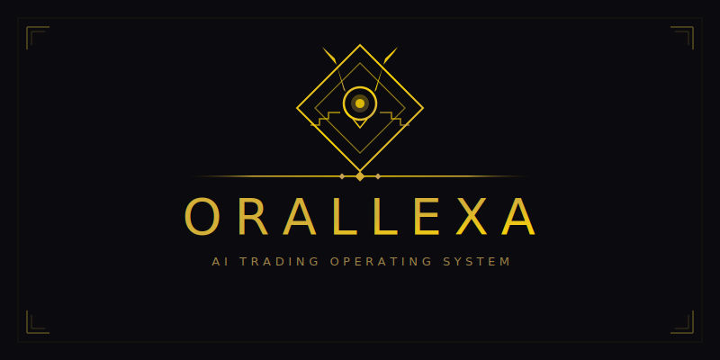
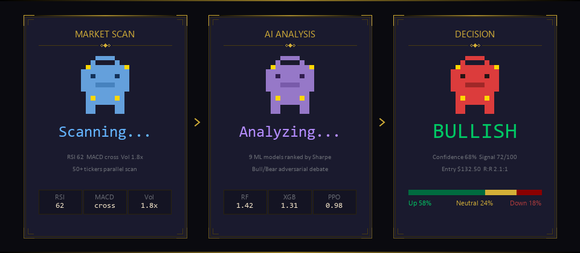
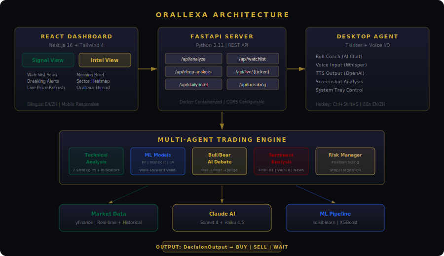
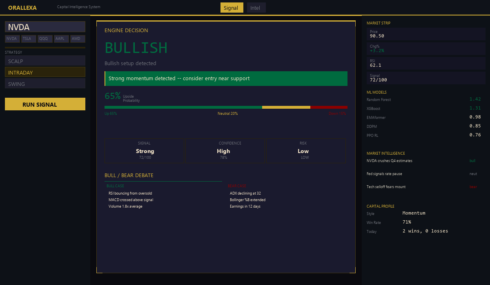

<div align="center">



<br>

### AI Trading Operating System

**9 ML models. Adversarial debate. One-click execution.**<br>
Don't guess the market. Let AI argue about it first.

<br>

[](https://github.com/alex-jb/orallexa-ai-trading-agent)
[](https://python.org)
[](https://nextjs.org)
[](https://anthropic.com)
[](tests/)
[](LICENSE)

<br>

[**Live Demo**](https://orallexa-ui.vercel.app) · [**Presentation**](https://alex-jb.github.io/orallexa-ai-trading-agent/presentation.html) · [**Evaluation Report**](docs/evaluation_report.md) · [**中文**](README_CN.md)

<br>



</div>

<br>

## What makes this different

Most AI trading projects: feed data into a model, get a signal, done.

Orallexa runs a **full adversarial pipeline**. A Bull AI argues for the trade. A Bear AI argues against it. A Judge AI makes the final call with evidence from both sides. Then it executes.

```
Market Data → 9 ML Models → Bull/Bear Debate → Judge Verdict
    → Risk Plan → Paper Execution → Dashboard → Social Content
```

Every stage automated. Every stage observable. The system runs continuously.

---

## Try it instantly

**[Open Live Demo](https://orallexa-ui.vercel.app)** — demo mode, no API key needed. Click **NVDA**, **TSLA**, or **QQQ** to see a full analysis.

Or run locally:

```bash
git clone https://github.com/alex-jb/orallexa-ai-trading-agent.git
cd orallexa-ai-trading-agent
pip install -r requirements.txt
echo "ANTHROPIC_API_KEY=your_key" > .env

# Terminal 1: API
python api_server.py

# Terminal 2: UI
cd orallexa-ui && npm install && npm run dev
```

Docker: `docker compose up --build` — that's it.

---

## Walk-Forward Evaluation (Out-of-Sample)

<!-- EVAL_TABLE_START -->
| Strategy | Ticker | OOS Sharpe | Info Ratio | MC Pct | p-value |
|----------|--------|-----------|------------|--------|---------|
| rsi_reversal | INTC | **1.41** | 0.45 | 43.4% | 0.002 |
| alpha_combo | JPM | **1.11** | -1.26 | 97.4% | 0.135 |
| trend_momentum | JPM | **1.09** | -0.80 | 90.2% | 0.104 |
| macd_crossover | JPM | **0.99** | -1.02 | 100% | 0.236 |
| dual_thrust | NVDA | **0.96** | -0.93 | 89.4% | 0.001 |
<!-- EVAL_TABLE_END -->

> 70 strategy-ticker pairs evaluated. Top 5 by OOS Sharpe shown. The value is in the ML ensemble + LLM synthesis layer above rule-based strategies. [Full report →](docs/evaluation_report.md)

---

## Architecture

<p align="center">
  
</p>

<table>
<tr>
<td width="50%">

### Intelligence Layer

| Component | Detail |
|-----------|--------|
| **9 ML Models** | RF, XGB, EMAformer, MOIRAI-2, Chronos-2, DDPM, PPO RL, GNN, LR |
| **Adversarial Debate** | Bull/Bear/Judge via Claude Sonnet + Haiku |
| **Strategy Evolution** | LLM generates Python strategies → sandbox tests → evolves winners |
| **Daily Intel** | 50+ tickers, sector rotation, volume spikes, AI morning brief |

</td>
<td width="50%">

### Execution Layer

| Component | Detail |
|-----------|--------|
| **Paper Trading** | Alpaca bracket orders with auto stop-loss/take-profit |
| **Real-time Stream** | WebSocket prices every 5s + signal change alerts |
| **Dashboard** | Next.js 16, Art Deco theme, EN/ZH bilingual |
| **Desktop Coach** | Floating AI pet with voice input (Whisper) + TTS |

</td>
</tr>
</table>

---

## Example Output

What one NVDA analysis produces:

```
┌─────────────────────────────────────────────────────────────────┐
│  DECISION: BUY                    Confidence: 68%               │
│  Risk: MEDIUM                     Signal: 72/100                │
├─────────────────────────────────────────────────────────────────┤
│                                                                 │
│  BULL CASE:                                                     │
│  • Price above MA20 > MA50 — full bullish alignment             │
│  • RSI at 62 — strong momentum, not yet overbought              │
│  • Volume 1.8x average — institutional participation likely     │
│                                                                 │
│  BEAR CASE:                                                     │
│  • ADX at 32 but declining — trend may be exhausting            │
│  • Bollinger %B at 0.85 — extended near upper band              │
│  • Earnings in 12 days — vol crush after event                  │
│                                                                 │
│  JUDGE VERDICT:                                                 │
│  "Bull case is stronger. BUY with tight stop at MA20."          │
│                                                                 │
│  PROBABILITIES: Up 58% | Neutral 24% | Down 18%                │
│  RISK PLAN:                                                     │
│  Entry: $132.50 | Stop: $128.40 | Target: $141.00 | R:R 2.1:1  │
└─────────────────────────────────────────────────────────────────┘
```

Not just a number. A structured argument with transparent reasoning and an actionable risk plan.

---

## 9 ML Models — Scored and Ranked

Every analysis runs all available models. The ML Scoreboard shows Sharpe, return, win rate side by side.

| Model | Type | What It Does |
|-------|------|-------------|
| Random Forest | Classification | 28 technical features → 5-day direction |
| XGBoost | Gradient Boosting | Same features, different optimization |
| Logistic Regression | Linear | Regularized baseline |
| **EMAformer** | Transformer | iTransformer + Embedding Armor (AAAI 2026) |
| **MOIRAI-2** | Foundation | Salesforce zero-shot time series forecaster |
| **Chronos-2** | Foundation | Amazon T5-based probabilistic forecaster |
| **DDPM Diffusion** | Generative | 50 possible price paths → VaR and confidence intervals |
| **PPO RL Agent** | Reinforcement | Gymnasium env, Sharpe-based reward |
| **GNN (GAT)** | Graph | 17-stock relationship graph, inter-stock signal propagation |

All models run on CPU.

---

## Dashboard

<p align="center">
  
</p>

**Signal View** — Decision card, probability bars, Bull/Bear debate, ML scoreboard, risk plan.<br>
**Intel View** — Morning brief, gainers/losers, sector heatmap, volume spikes, AI picks, social thread.

Art Deco theme. Polymarket-inspired probability display. Mobile responsive. EN/ZH bilingual.

---

## Desktop AI Coach

A floating pixel bull that lives on your desktop:

- **Voice chat** — Hold K to talk, Whisper transcribes, Claude responds
- **Chart analysis** — Ctrl+Shift+S screenshots any chart for Claude Vision analysis
- **Decision cards** — Entry, stop, target, risk/reward overlaid on screen
- **Market-aware avatar** — Bull changes color based on market conditions

---

## Cost-Aware AI

Not every task needs the expensive model:

| Task | Model | Cost |
|------|-------|------|
| Bull/Bear arguments | Haiku 4.5 | ~$0.001 |
| Signal overlay | Haiku 4.5 | ~$0.001 |
| Judge verdict | Sonnet 4.6 | ~$0.005 |
| Deep market report | Sonnet 4.6 | ~$0.005 |

**One full analysis: ~$0.003.** One daily intel report: ~$0.05.

---

## Why this architecture

| Problem | Typical Approach | Orallexa |
|---------|-----------------|----------|
| Isolated signals | One model, one prediction | 9 models ranked by Sharpe + LLM synthesis |
| No reasoning | "BUY 73%" — why? | Bull argues, Bear argues, Judge decides with evidence |
| Expensive AI | Every call hits GPT-4 | Haiku for 80%, Sonnet only where reasoning matters |
| Manual workflow | Notebook → read → decide → execute | Automated: signal → debate → risk plan → paper order |
| No context | Each stock analyzed alone | GNN propagates signals across 17 related stocks |
| Not shareable | Screenshot your terminal | "Copy for X" on every section |

---

## Orallexa vs ai-hedge-fund

Inspired by [ai-hedge-fund](https://github.com/virattt/ai-hedge-fund). We share the multi-agent philosophy but take different approaches:

| Feature | ai-hedge-fund | Orallexa |
|---------|:------------:|:--------:|
| ML Models | 0 (LLM-only) | 9 (RF, XGB, EMAformer, MOIRAI-2, Chronos-2, DDPM, PPO RL, GNN, LR) |
| Model Ranking | No | Auto-ranked by Sharpe ratio |
| LLM Providers | OpenAI, Groq, Anthropic, DeepSeek | Claude Sonnet + Haiku (dual-tier routing) |
| Cost per Analysis | ~$0.03+ (single-tier) | ~$0.003 (80% Haiku, 20% Sonnet) |
| Real-time Dashboard | Basic web UI | Next.js 16 with WebSocket, Art Deco theme |
| Paper Trading | No execution | Alpaca bracket orders (stop-loss + take-profit) |
| Daily Intelligence | No | 50+ tickers, sector rotation, AI morning brief |
| Desktop Assistant | No | Pixel bull with voice (Whisper + TTS) |
| Social Content | No | One-click "Copy for X" on every section |
| Walk-Forward Eval | No | 70 strategy-ticker pairs, OOS Sharpe |
| Tests | Limited | 277 automated (139 frontend + 138 backend) |
| Bilingual | No | EN/ZH |

---

## Tech Stack

<table>
<tr><td><b>Frontend</b></td><td>Next.js 16, React 19, Tailwind CSS 4, PWA</td></tr>
<tr><td><b>Backend</b></td><td>FastAPI, Python 3.11, WebSocket</td></tr>
<tr><td><b>AI</b></td><td>Claude Sonnet 4.6 + Haiku 4.5 (dual-tier routing)</td></tr>
<tr><td><b>ML</b></td><td>scikit-learn, XGBoost, PyTorch (EMAformer, DDPM, GAT, PPO)</td></tr>
<tr><td><b>Data</b></td><td>yfinance (real-time + historical)</td></tr>
<tr><td><b>NLP</b></td><td>FinBERT, VADER, TextBlob</td></tr>
<tr><td><b>Trading</b></td><td>Alpaca paper trading (bracket orders)</td></tr>
<tr><td><b>Orchestration</b></td><td>LangGraph (stateful debate pipeline)</td></tr>
<tr><td><b>Deploy</b></td><td>Docker, GitHub Actions CI/CD, Vercel</td></tr>
</table>

---

## Testing

277 automated tests. 0 failures. CI on every push.

```bash
python -m pytest tests/ -v           # Backend (113 tests)
cd orallexa-ui && npm test           # Frontend (139 tests)
```

<details>
<summary><b>Full test breakdown</b></summary>

| Suite | Tests | Coverage |
|-------|-------|----------|
| Engine Integration | 34 | TA indicators, strategies, backtest, brain routing |
| ML Regression | 13 | All 9 models — ensures upgrades don't degrade |
| API E2E | 19 | Every endpoint via FastAPI TestClient |
| Unit Tests | 47 | DecisionOutput, BehaviorMemory, risk, scalping |
| Types & Helpers | 28 | Display functions, color mapping, i18n |
| Components | 67 | DecisionCard, Breaking, MarketStrip, ML Scoreboard, Watchlist, DailyIntel |
| Mock Data | 31 | All mock generators |

</details>

---

## API

<details>
<summary><b>Endpoints</b></summary>

| Method | Endpoint | Description |
|--------|----------|-------------|
| `POST` | `/api/analyze` | Fast signal analysis (scalp/intraday/swing) |
| `POST` | `/api/deep-analysis` | Multi-agent deep analysis with debate |
| `POST` | `/api/chart-analysis` | Screenshot chart analysis (Claude Vision) |
| `POST` | `/api/watchlist-scan` | Parallel multi-ticker scan |
| `GET` | `/api/daily-intel` | Daily market intelligence (cached) |
| `GET` | `/api/news/{ticker}` | News + sentiment scores |
| `GET` | `/api/profile` | Trader behavior profile |
| `GET` | `/api/journal` | Decision execution log |
| `POST` | `/api/evolve-strategies` | LLM strategy evolution |
| `GET` | `/api/alpaca/account` | Paper trading account |
| `POST` | `/api/alpaca/execute` | Execute signal as paper order |
| `WS` | `/ws/live` | Real-time price + signal stream |

</details>

---

## Project Structure

<details>
<summary><b>Directory layout</b></summary>

```
orallexa/
├── api_server.py               # FastAPI + WebSocket server
├── docker-compose.yml          # One-click deployment
│
├── engine/                     # Trading engine (9 models)
│   ├── multi_agent_analysis.py # LangGraph debate pipeline
│   ├── ml_signal.py            # Model comparison framework
│   ├── strategies.py           # 7 rule-based strategies
│   ├── emaformer.py            # EMAformer Transformer
│   ├── diffusion_signal.py     # DDPM probabilistic forecasting
│   ├── gnn_signal.py           # Graph Attention Network
│   ├── rl_agent.py             # PPO reinforcement learning
│   ├── strategy_evolver.py     # LLM strategy evolution
│   └── sentiment.py            # FinBERT / VADER
│
├── llm/                        # AI reasoning
│   ├── claude_client.py        # Dual-tier model routing
│   ├── debate.py               # Bull/Bear debate
│   └── debate_graph.py         # LangGraph pipeline
│
├── orallexa-ui/                # Dashboard (Next.js 16)
├── desktop_agent/              # Desktop AI coach
├── bot/                        # Execution layer (Alpaca)
├── tests/                      # 138 backend tests
└── .github/workflows/          # CI/CD
```

</details>

---

## Acknowledgments

[Anthropic Claude](https://anthropic.com) · [yfinance](https://github.com/ranaroussi/yfinance) · [Polymarket](https://polymarket.com) · [Alpaca](https://alpaca.markets)

---

<div align="center">

**MIT License** — see [LICENSE](LICENSE)

> **Disclaimer**: Research and educational project. Not financial advice.

<br>

**Built with conviction, not hype.**

</div>
