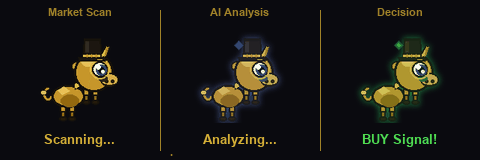

<div align="center">


# Orallexa

### AI Trading Operating System



[](https://python.org)
[](https://nextjs.org)
[](https://anthropic.com)
[](tests/)
[-green?style=flat-square)](docs/evaluation_report.md)
[](https://docker.com)
[](LICENSE)

An end-to-end trading intelligence system that goes from raw market data
to executed paper trades — with 9 ML models, LLM reasoning, real-time dashboard,
and one-click social content along the way.

[Live Demo](https://orallexa-ui.vercel.app) | [Presentation](https://alex-jb.github.io/orallexa-ai-trading-agent/presentation.html) | [中文](README_CN.md)

</div>

---

## This Is Not Just a Trading Bot

Most AI trading projects do one thing: feed data into a model, get a signal, done.

Orallexa is a **full operating system for trading intelligence**. It handles the entire pipeline:

```
Market Data → 9 ML Models → LLM Reasoning → Adversarial Debate
    → Risk Plan → Paper Execution → Real-time Dashboard → Social Content
```

Every stage is automated. Every stage is observable. The system runs continuously — scanning markets, generating intelligence, pushing signals, and producing ready-to-post content.

---

## Strategy Evaluation (Walk-Forward OOS)

<!-- EVAL_TABLE_START -->
| Strategy | Ticker | OOS Sharpe | Info Ratio | MC Pct | p-value | Verdict |
|----------|--------|-----------|------------|--------|---------|---------|
| rsi_reversal | INTC | 1.409 | 0.445 | 43.4% | 0.0018 | FAIL |
| alpha_combo | JPM | 1.111 | -1.259 | 97.4% | 0.1354 | FAIL |
| trend_momentum | JPM | 1.092 | -0.804 | 90.2% | 0.1037 | FAIL |
| macd_crossover | JPM | 0.987 | -1.016 | 100.0% | 0.2360 | FAIL |
| dual_thrust | NVDA | 0.960 | -0.931 | 89.4% | 0.0006 | FAIL |
| alpha_combo | NVDA | 0.920 | -1.073 | 99.8% | 0.0163 | FAIL |
| macd_crossover | NVDA | 0.909 | -1.007 | 100.0% | 0.0025 | FAIL |
| double_ma | JPM | 0.796 | -1.030 | 93.2% | 0.1291 | FAIL |
| dual_thrust | JPM | 0.742 | -1.416 | 100.0% | 0.1810 | FAIL |
| trend_momentum | NVDA | 0.738 | -1.125 | 83.1% | 0.0046 | FAIL |
<!-- EVAL_TABLE_END -->

> 70 strategy-ticker pairs (7 strategies x 10 tickers). Top 10 by OOS Sharpe. [Full report](docs/evaluation_report.md)

---

## The System

<p align="center">
  
</p>

| Layer | What It Does | Technology |
|-------|-------------|------------|
| **Data** | 50+ tickers, sector ETFs, news, volume detection | yfinance, parallel fetch |
| **Models** | 9 ML models scored and ranked automatically | RF, XGB, EMAformer, MOIRAI-2, Chronos-2, DDPM, PPO RL, GNN, LR |
| **Reasoning** | Bull/Bear adversarial debate on every signal | Claude Sonnet + Haiku (dual-tier) |
| **Decision** | Structured output: decision, confidence, probabilities, risk plan | LangGraph pipeline |
| **Execution** | Bracket orders with auto stop-loss and take-profit | Alpaca paper trading |
| **Intelligence** | Daily morning brief, AI picks, sector rotation, volume alerts | Cached per day, 3 LLM calls |
| **Dashboard** | Real-time UI with live prices, WebSocket stream, EN/ZH bilingual | Next.js 16, Art Deco theme |
| **Social** | Per-section "Copy for X" — one click to post on Twitter | LLM-generated, plain language |
| **Desktop** | Floating AI coach with voice input, chart screenshot analysis | Tkinter, Whisper, TTS |

---

## Example Output — NVDA Analysis

This is what one analysis produces. It's one output of a much larger system:

```
┌─────────────────────────────────────────────────────────────────┐
│  DECISION: BUY                    Confidence: 68%               │
│  Risk: MEDIUM                     Signal: 72/100                │
├─────────────────────────────────────────────────────────────────┤
│                                                                 │
│  BULL CASE:                                                     │
│  • Price above MA20 > MA50 — full bullish alignment             │
│  • RSI at 62 — strong momentum, not yet overbought              │
│  • Volume 1.8x average — institutional participation likely     │
│  • MACD histogram rising — momentum accelerating                │
│                                                                 │
│  BEAR CASE:                                                     │
│  • ADX at 32 but declining — trend may be exhausting            │
│  • Bollinger %B at 0.85 — extended near upper band              │
│  • Sector (XLK) up 3 days straight — mean reversion risk        │
│  • Earnings in 12 days — vol crush after event                  │
│                                                                 │
│  JUDGE VERDICT:                                                 │
│  "Bull case is stronger — momentum and volume confirm the       │
│   trend. But the Bear's earnings risk is valid. Position         │
│   size should be reduced. BUY with tight stop at MA20."         │
│                                                                 │
│  PROBABILITIES: Up 58% | Neutral 24% | Down 18%                │
│                                                                 │
│  RISK PLAN:                                                     │
│  Entry: $132.50 | Stop: $128.40 | Target: $141.00 | R:R 2.1:1  │
│  Position: 5% of portfolio | Key risk: Earnings vol event       │
└─────────────────────────────────────────────────────────────────┘
```

Not just a number. A structured argument with transparent reasoning, probability breakdown, and an actionable risk plan.

Want to share this? Every analysis has a built-in "Copy for X" button that formats the output into a social-ready post.

---

## Try It Instantly

**[Open Live Demo](https://orallexa-ui.vercel.app)** — runs in demo mode, no API key needed.

Click **NVDA**, **TSLA**, or **QQQ** quick-start buttons to see a full analysis in seconds.

---

## Early Results

We don't publish synthetic benchmarks. Here's what the architecture delivers:

- **Cost efficiency** — Dual-model routing (Haiku for 80% of calls, Sonnet for reasoning) reduces LLM cost to ~$0.003 per analysis versus $0.03+ with a single expensive model
- **Structured reasoning** — Adversarial debate produces more stable outputs than single-model prediction. The Bull/Bear format catches blind spots that one-shot prompts miss
- **Pipeline speed** — Full analysis (9 models + debate + risk plan) completes in ~15 seconds. Daily intel for 50+ tickers in ~10 seconds
- **Test coverage** — 252 automated tests (139 frontend + 113 backend) with 0 failures, CI/CD on every push

---

## Why This Matters

| Problem | Typical Approach | Orallexa |
|---------|-----------------|----------|
| **Isolated signals** | One model, one prediction | 9 models ranked by Sharpe ratio + LLM synthesis |
| **No reasoning** | "BUY 73%" — why? | Bull argues for, Bear argues against, Judge decides with evidence |
| **Expensive AI** | Every call hits GPT-4 | Haiku for 80% of calls, Sonnet only where reasoning quality matters |
| **Manual workflow** | Run notebook → read output → decide → execute | Automated pipeline: signal → debate → risk plan → paper order |
| **No context** | Each stock analyzed alone | GNN propagates signals across 17 related stocks |
| **Stale data** | Run once, check later | WebSocket pushes prices every 5s, signal change alerts |
| **Not shareable** | Screenshot your terminal | "Copy for X" on every section — post to Twitter in one click |

---

## 9 ML Models — Scored and Ranked

Every analysis runs all available models and ranks them by Sharpe ratio:

| Model | Type | What It Does |
|-------|------|-------------|
| **Random Forest** | Classification | 28 technical features → 5-day direction |
| **XGBoost** | Gradient Boosting | Same features, different optimization |
| **Logistic Regression** | Linear | Regularized baseline |
| **EMAformer** | Transformer | iTransformer + Embedding Armor (AAAI 2026 architecture) |
| **MOIRAI-2** | Foundation | Salesforce zero-shot time series forecaster |
| **Chronos-2** | Foundation | Amazon T5-based probabilistic forecaster |
| **DDPM Diffusion** | Generative | 50 possible price paths → VaR and confidence intervals |
| **PPO RL Agent** | Reinforcement | Gymnasium env, Sharpe-based reward, auto stop-loss |
| **GNN (GAT)** | Graph | 17-stock relationship graph, inter-stock signal propagation |

All models run on CPU. The ML Scoreboard shows every model's Sharpe, return, win rate, and trade count side by side.

---

## Continuous Intelligence

Orallexa doesn't just analyze on demand. It runs a daily intelligence pipeline:

1. **Market Scan** — 50+ tickers, parallel fetch, top gainers/losers/volume spikes
2. **Sector Heatmap** — 13 sector ETFs, rotation detection
3. **News + Sentiment** — FinBERT scoring on live headlines
4. **AI Morning Brief** — 300-400 word summary with conviction
5. **AI Picks** — 3-5 tickers worth watching, with catalysts
6. **Social Thread** — 6-7 posts ready to copy-paste to Twitter/X

Every section has a **"Copy for X"** button. Plain language, not Wall Street jargon. Written like a sharp trader, not a Bloomberg terminal.

---

## Cost-Aware AI Architecture

Not every task needs the most expensive model:

| Task | Model | Cost | Why |
|------|-------|------|-----|
| Bull/Bear arguments | **Haiku 4.5** | ~$0.001 | Argumentation from data |
| Quick signal overlay | **Haiku 4.5** | ~$0.001 | Sanity check, not deep synthesis |
| Judge verdict | **Sonnet 4.6** | ~$0.005 | Final decision needs maximum reasoning |
| Deep market report | **Sonnet 4.6** | ~$0.005 | Nuanced analysis |

One full analysis: **~$0.003**. One daily intel report: **~$0.05**. Same quality, fraction of the cost.

---

## Engineering Depth

| Dimension | Detail |
|-----------|--------|
| **Models** | 9 ML models (classical + deep learning + RL + graph) |
| **Deep Learning** | EMAformer, DDPM Diffusion, GAT — all pure PyTorch, no heavy frameworks |
| **Strategy Evolution** | LLM generates Python strategy code → sandbox tests → evolves winners |
| **LangGraph** | Debate pipeline as a typed StateGraph with conditional routing |
| **Testing** | 252 automated tests — 139 frontend (vitest) + 113 backend (pytest) |
| **CI/CD** | GitHub Actions: lint + test + build on every push |
| **Deployment** | Docker Compose one-click, PWA mobile support |
| **Real-time** | WebSocket price stream + signal change detection |
| **Execution** | Alpaca paper trading with bracket orders (stop-loss + take-profit) |
| **Observability** | LLM call logging (model, latency, tokens, cost per call) |

---

## Dashboard

<p align="center">
  
</p>

Two views:

- **Signal View** — Run analysis on any ticker. Decision card, probability bars, Bull/Bear debate, investment plan, ML scoreboard, risk management.
- **Intel View** — Daily market intelligence. Morning brief, gainers/losers, sector heatmap, volume spikes, AI picks, social thread with copy buttons.

Art Deco theme. Polymarket-inspired probability display. Mobile responsive. EN/ZH bilingual.

---

## Desktop AI Coach

A floating assistant for hands-free trading analysis:

- Natural language chat with Claude AI
- Voice input (Whisper) + voice output (TTS)
- Screenshot any chart → Claude Vision analysis (Ctrl+Shift+S)
- Decision card with entry, stop, target, risk/reward
- System tray for quick ticker/mode switching

---

## Quick Start

### Try It Now (No Install)

**[Live Demo](https://orallexa-ui.vercel.app)** — runs in demo mode with simulated data, no API key needed.

### Option 1: Manual

```bash
git clone https://github.com/alex-jb/orallexa-ai-trading-agent.git
cd orallexa-ai-trading-agent
pip install -r requirements.txt

# Set API keys
echo "ANTHROPIC_API_KEY=your_key" > .env

# Optional: Alpaca paper trading (free, no real money)
# Get keys at https://app.alpaca.markets → Settings → API Keys
echo "ALPACA_API_KEY=your_key" >> .env
echo "ALPACA_SECRET_KEY=your_secret" >> .env

# Terminal 1: API server
python api_server.py

# Terminal 2: Dashboard
cd orallexa-ui && npm install && npm run dev
```

Open http://localhost:3000

### Option 2: Docker

```bash
docker compose up --build
# API → localhost:8002 | UI → localhost:3000
```

### Quick Test

```bash
curl -X POST http://localhost:8002/api/analyze \
  -F "ticker=NVDA" -F "mode=intraday" -F "timeframe=15m"
```

---

## Tech Stack

| Layer | Technology |
|-------|-----------|
| **Frontend** | Next.js 16, React 19, Tailwind CSS 4, PWA |
| **Backend** | FastAPI, Python 3.11, WebSocket |
| **AI** | Claude Sonnet 4.6 + Haiku 4.5 (dual-tier routing) |
| **ML** | scikit-learn, XGBoost, PyTorch (EMAformer, DDPM, GAT, PPO) |
| **Data** | yfinance (real-time + historical) |
| **NLP** | FinBERT, VADER, TextBlob |
| **Trading** | Alpaca paper trading (bracket orders) |
| **Orchestration** | LangGraph (stateful debate pipeline) |
| **Deployment** | Docker, GitHub Actions CI/CD |

---

## Testing

```bash
# Backend (Python)
python -m pytest tests/ -v              # All tests (~3 min)
python -m pytest tests/ -k "not ml"     # Fast tests (~20s)

# Frontend (Next.js)
cd orallexa-ui && npm test              # Vitest + Testing Library
```

| Suite | Tests | What It Covers |
|-------|-------|----------------|
| **Backend** | | |
| Engine Integration | 34 | TA indicators, 6 strategies, backtest, brain routing, alerts |
| ML Regression | 13 | All 9 models — ensures upgrades don't degrade performance |
| API E2E | 19 | Every endpoint via FastAPI TestClient |
| Unit Tests | 47 | DecisionOutput, BehaviorMemory, risk management, scalping |
| **Frontend** | | |
| Types & Helpers | 28 | Display functions, color mapping, news summary, i18n |
| Atoms | 12 | Heading, Row, Toggle, CopyBtn render + behavior |
| Mock Data | 31 | All mock generators — probabilities, profiles, journal |
| DecisionCard | 17 | Empty/BUY/SELL states, investment plan, toggles |
| BreakingBanner | 11 | All signal types, EN/ZH explanations, severity styles |
| MarketStrip | 10 | Live price, RSI, H/L, flash animation, live indicator |
| MLScoreboard | 7 | Headers, best model highlight, sharpe/return/win% |
| WatchlistGrid | 9 | Click handler, error display, probability display |
| DailyIntelView | 14 | Mood, movers, sectors, AI picks, volume spikes, thread |

---

## API Reference

| Method | Endpoint | Description |
|--------|----------|-------------|
| `POST` | `/api/analyze` | Fast signal analysis (scalp/intraday/swing) |
| `POST` | `/api/deep-analysis` | Multi-agent deep analysis with debate |
| `POST` | `/api/chart-analysis` | Screenshot chart analysis (Claude Vision) |
| `POST` | `/api/watchlist-scan` | Parallel multi-ticker scan |
| `GET` | `/api/daily-intel` | Daily market intelligence (cached) |
| `GET` | `/api/news/{ticker}` | News + sentiment scores |
| `GET` | `/api/profile` | Trader behavior profile |
| `GET` | `/api/journal` | Decision execution log |
| `POST` | `/api/evolve-strategies` | LLM strategy evolution |
| `GET` | `/api/alpaca/account` | Paper trading account |
| `POST` | `/api/alpaca/execute` | Execute signal as paper order |
| `WS` | `/ws/live` | Real-time price + signal stream |

---

## Project Structure

```
orallexa/
├── api_server.py               # FastAPI + WebSocket server
├── docker-compose.yml          # One-click deployment
│
├── engine/                     # Trading engine (9 models)
│   ├── multi_agent_analysis.py # Multi-agent pipeline
│   ├── ml_signal.py            # Model comparison framework
│   ├── strategies.py           # 7 rule-based strategies
│   ├── emaformer.py            # EMAformer Transformer
│   ├── diffusion_signal.py     # DDPM probabilistic forecasting
│   ├── gnn_signal.py           # Graph Attention Network
│   ├── rl_agent.py             # PPO reinforcement learning
│   ├── strategy_evolver.py     # LLM strategy evolution
│   └── sentiment.py            # FinBERT / VADER
│
├── llm/                        # AI reasoning
│   ├── claude_client.py        # Dual-tier model routing
│   ├── debate.py               # Bull/Bear debate
│   └── debate_graph.py         # LangGraph pipeline
│
├── orallexa-ui/                # Dashboard (Next.js)
├── desktop_agent/              # Desktop AI coach
│
├── bot/                        # Execution layer
│   ├── alpaca_executor.py      # Alpaca paper trading
│   ├── paper_trading.py        # Trade journal
│   └── alerts.py               # Price alerts
│
├── tests/                      # 113 backend tests (pytest)
├── orallexa-ui/app/__tests__/  # 139 frontend tests (vitest)
└── .github/workflows/          # CI/CD pipelines (lint + test + build)
```

---

## Presentation

Interactive 21-slide presentation covering the full system:

[View Presentation](https://alex-jb.github.io/orallexa-ai-trading-agent/presentation.html) | Arrow keys to navigate | ~15 min talk

---

## Acknowledgments

- [Anthropic Claude](https://anthropic.com) — AI reasoning engine
- [yfinance](https://github.com/ranaroussi/yfinance) — Market data
- [Polymarket](https://polymarket.com) — Probability-first UI inspiration

---

## License

MIT License — see [LICENSE](LICENSE).

> **Disclaimer**: Orallexa is a research and educational project. Not financial advice. Always do your own research.

---

<div align="center">

**Built with conviction, not hype.**

</div>
