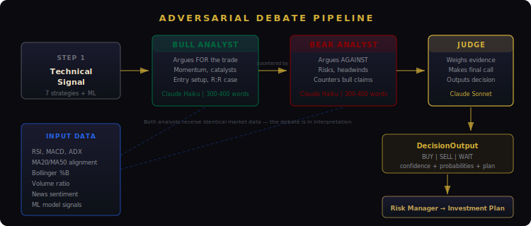
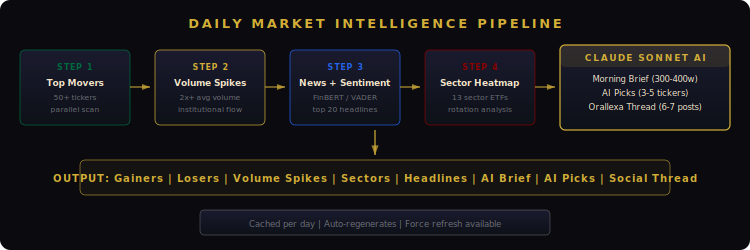

<div align="center">


# Orallexa

### AI 交易操作系统


[](https://python.org)
[](https://nextjs.org)
[](https://anthropic.com)
[](tests/)
[](https://fastapi.tiangolo.com)
[](https://docker.com)
[](LICENSE)

大多数 AI 交易工具让一个模型预测市场。
**Orallexa 让它们先辩论。**

一个 Bull 分析师构建看多论据。一个 Bear 分析师逐条反驳。
一个 Judge 裁判权衡双方，做出最终决策。
结果：每个决策在资金入场前都经过了质疑。

[English](README.md) | [中文](#示例--nvda-分析)

---

🚀 [工作原理](#工作原理) | 📊 [示例输出](#示例--nvda-分析) | ⚡ [快速开始](#快速开始) | 🔍 [为什么选 Orallexa](#为什么-orallexa-不同) | 📡 [API](#api-接口) | 🤝 [贡献](#参与贡献)

</div>

---

## 示例 — NVDA 分析

以下是 Orallexa 对单只股票的真实输出结构：

```
┌─────────────────────────────────────────────────────────────────┐
│  决策: BUY                        置信度: 68%                    │
│  风险: MEDIUM                     信号: 72/100                   │
├─────────────────────────────────────────────────────────────────┤
│                                                                 │
│  多方论据 (BULL):                                                │
│  • 价格位于 MA20 > MA50 上方 — 完全看多排列                       │
│  • RSI 62 — 强劲动量，尚未超买                                    │
│  • 成交量 1.8 倍均值 — 可能有机构参与                              │
│  • MACD 柱状图上升 — 动量加速                                     │
│                                                                 │
│  空方论据 (BEAR):                                                │
│  • ADX 32 但下降 — 趋势可能衰竭                                   │
│  • 布林带 %B 0.85 — 接近上轨，过度延伸                            │
│  • 板块 (XLK) 连涨 3 天 — 均值回归风险                            │
│  • 12 天后财报 — 事件后波动率压缩                                  │
│                                                                 │
│  裁判判决 (JUDGE):                                               │
│  "多方论据更强 — 动量和成交量确认了趋势。但空方的财报风险           │
│   有效。应减小仓位。建议买入，止损设在 MA20。"                      │
│                                                                 │
│  概率: 上涨 58% | 震荡 24% | 下跌 18%                            │
│                                                                 │
│  风控计划:                                                       │
│  入场: $132.50 | 止损: $128.40 | 目标: $141.00 | 风险收益比 2.1:1 │
│  仓位: 5% | 主要风险: 财报波动事件                                 │
└─────────────────────────────────────────────────────────────────┘
```

每个决策都包含多方论据、空方反驳、理性裁决、概率分布和具体风控计划。不是一个数字 — 是一套结构化论证。

---

## 为什么 Orallexa 不同

| 方式 | 传统 AI 交易 | Orallexa |
|------|-------------|----------|
| 决策方式 | ❌ 单模型预测方向 | ✅ 多空辩论，裁判决策 |
| 推理过程 | ❌ 黑盒置信度分数 | ✅ 透明论证链，可阅读 |
| 模型使用 | ❌ 一个昂贵模型处理一切 | ✅ 双层路由 — 快速模型做结构，深度模型做推理 |
| 成本控制 | ❌ 每次调用都烧 token | ✅ Token 优化 + 重试处理 |
| 输出 | ❌ "买入 73% 置信度" | ✅ 多方论据 + 空方反驳 + 裁判判决 + 风控计划 |
| 产品层 | ❌ 脚本和笔记本 | ✅ 仪表盘、桌面助手、每日情报、语音分析 |

---

## Orallexa vs TradingAgents

我们受到 [TradingAgents](https://github.com/TauricResearch/TradingAgents) 多智能体交易研究的启发。Orallexa 将这一思想扩展为产品化、成本优化、可部署的系统：

| 功能 | TradingAgents | Orallexa |
|------|:------------:|:--------:|
| 多智能体架构 | ✅ | ✅ |
| 对抗性多空辩论 | ✅ | ✅ 增强版 (300-400 字结构化论证) |
| 双模型路由 (Fast/Deep) | ❌ | ✅ Haiku 做结构，Sonnet 做推理 |
| Token + 成本优化 | ❌ | ✅ 预算控制、重试、缓存 |
| 实时仪表盘 | ❌ | ✅ Next.js + 实时价格 + 警报 + 自选股 |
| 每日市场情报 | ❌ | ✅ 50+ 标的扫描 + AI 晨间简报 |
| 社交媒体推文生成 | ❌ | ✅ 一键复制的 Orallexa Thread |
| 桌面语音助手 | ❌ | ✅ Bull Coach + Whisper + TTS |
| 截图图表分析 | ❌ | ✅ Claude Vision 集成 |
| 成交量异动检测 | ❌ | ✅ 机构活动扫描 |
| 移动端适配 | ❌ | ✅ Art Deco 主题，中英双语 |
| Docker 部署 | ❌ | ✅ `docker compose up` 一键启动 |
| 生产级 API | ❌ | ✅ 11 个 REST 端点 + CORS |

---

## 工作原理

<p align="center">
  
</p>

Orallexa 对每次分析运行 **5 Agent 管道**：

| Agent | 职责 | 模型 |
|-------|------|------|
| **技术分析师** | 7 种策略 + 指标 (RSI, MACD, 布林带, ADX, 均线排列) | 本地 |
| **ML 引擎** | 随机森林、XGBoost、逻辑回归 + 滚动验证 | 本地 |
| **情绪分析师** | FinBERT/VADER 对实时新闻评分 | 本地 |
| **Bull + Bear 辩论** | 对抗论证 — Bull 看多，Bear 看空 | Claude Haiku (快速) |
| **Judge 裁判** | 综合双方 → 最终决策 + 概率 + 投资计划 | Claude Sonnet (深度) |

前三个 Agent 在本地运行，零 API 成本。只有辩论和裁决需要 LLM 调用 — 并且使用双层路由最小化开支。

### 对抗辩论管道

<p align="center">
  
</p>

### 每日市场情报

<p align="center">
  
</p>

每天早上自动：扫描 50+ 标的 → 检测成交量异动 → 板块轮动分析 → AI 晨间简报 → AI 推荐 → 社交推文串。

---

## 核心创新

### 1. 对抗辩论推理
不是问一个模型"该不该买"，而是创建结构化辩论。Bull 必须找到最强看多论据，Bear 必须用具体风险反驳，Judge 不能偷懒 — 双方都摆了证据。

### 2. 双层模型路由
不是每个任务都需要最贵的模型。JSON 解析用 Haiku (~0.5s)，论证用 Haiku (~1s)，最终裁决用 Sonnet (~3s)。同等质量，成本大幅降低。

### 3. 系统优化

| 优化 | 作用 |
|------|------|
| **max_tokens 控制** | 每次调用精确 token 预算 |
| **双模型路由** | 80% 调用用 Haiku，Sonnet 仅用于推理 |
| **响应缓存** | 每日情报按天缓存 |
| **重试处理** | API 过载时优雅降级为纯技术信号 |
| **置信度护栏** | 硬上限 82% — 没有模型可以宣称确定 |

---

## 仪表盘

<p align="center">
  
</p>

两个视图：**Signal**（实时分析）和 **Intel**（每日情报）。Art Deco 金色主题，Polymarket 概率展示，移动端适配，中英双语。

---

## 快速开始

```bash
git clone https://github.com/alex-jb09/orallexa.git
cd orallexa
pip install -r requirements.txt
cp .env.example .env
```

```bash
export ANTHROPIC_API_KEY=...       # 必需
export OPENAI_API_KEY=...          # 可选，仅桌面语音
```

```bash
python api_server.py               # API 服务
cd orallexa-ui && npm install && npm run dev  # 仪表盘
```

Docker 一键：`docker compose up --build`

---

## 灵感来源

Orallexa 受多智能体交易研究启发，特别是 [TradingAgents](https://github.com/TauricResearch/TradingAgents)。我们共享核心理念：**多个专业 Agent 比单一模型做出更好的交易决策。**

我们的不同之处：Orallexa 将研究框架扩展为**可部署的产品** — 实时仪表盘、成本优化模型路由、每日情报自动化、语音桌面助手、Docker 部署。目标不只是跑实验，而是构建交易者每天都能使用的工具。

---

## 关注项目

我们每天发布 AI 生成的市场情报和开发动态：

- **X/Twitter**: [@orallexa](https://x.com/orallexa) *(即将上线)*
- **每日情报**: 每天早上自动生成 — 异动股、成交量异动、AI 推荐

---

## Star History

<div align="center">
<a href="https://www.star-history.com/#alex-jb09/orallexa&Date">
 <picture>
   <source media="(prefers-color-scheme: dark)" srcset="https://api.star-history.com/svg?repos=alex-jb09/orallexa&type=Date&theme=dark" />
   <source media="(prefers-color-scheme: light)" srcset="https://api.star-history.com/svg?repos=alex-jb09/orallexa&type=Date" />
   
 </picture>
</a>
</div>

---

## 参与贡献

1. Fork 仓库
2. 创建功能分支 (`git checkout -b feat/amazing-feature`)
3. 提交更改 (`git commit -m 'feat: add amazing feature'`)
4. 推送 (`git push origin feat/amazing-feature`)
5. 提交 Pull Request

开发历史详见 [CHANGELOG.md](CHANGELOG.md)。

---

## 开源协议

MIT License — 详见 [LICENSE](LICENSE)。

> **免责声明**: Orallexa 是研究和教育项目，不构成投资建议。投资决策请自行研究。

---

<div align="center">

**如果 Orallexa 对你的研究有帮助，请给个 ⭐**

</div>
