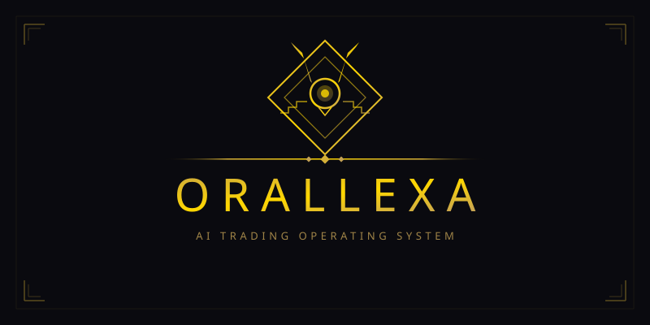
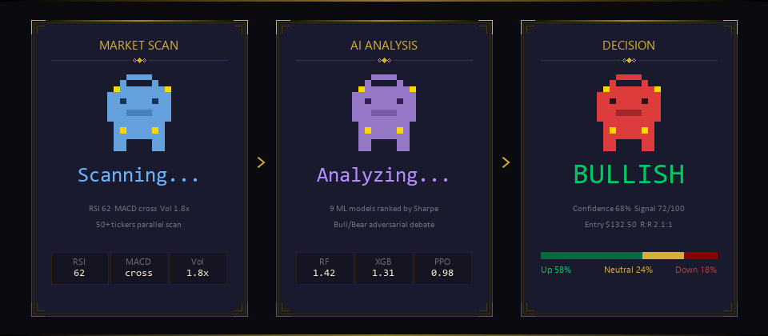
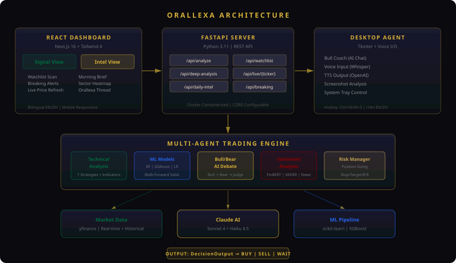
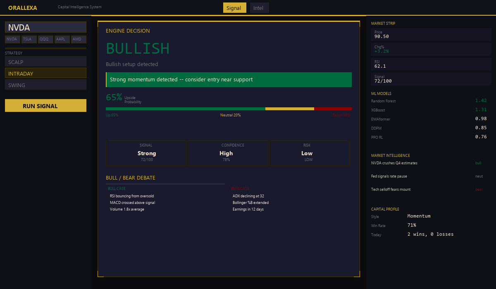

<div align="center">



<br>

### 多智能体模拟交易研究系统

**多源信号融合、对抗辩论、Alpaca 模拟交易。**<br>
这是研究原型；概率校准和超额收益尚未得到独立验证。仓库中的 broker 执行仅限 Alpaca paper，Brier 门槛不能开启真钱下单。

<br>

[](https://github.com/alex-jb/orallexa-ai-trading-agent)
[](https://python.org)
[](https://nextjs.org)
[](https://anthropic.com)
[](https://github.com/alex-jb/orallexa-ai-trading-agent/actions/workflows/ci.yml)
[](LICENSE)

<br>

[**在线演示**](https://orallexa-ui.vercel.app) · [**演示文稿**](https://alex-jb.github.io/orallexa-ai-trading-agent/presentation.html) · [**评估报告**](docs/evaluation_report.md) · [**English**](README.md)

<br>



</div>

<br>

## 这个项目有什么不同

大多数 AI 交易项目：把数据喂给模型，得到信号，结束。

Orallexa 提供**多智能体分析管道**：多视角面板和多空辩论生成研究意见，规则群体进行假设推演，信号融合结合可用数据源，偏差追踪器记录历史错误。下单需要另行主动请求，且仅发送到 Alpaca 模拟账户。

```
市场数据 → 9 个 ML 模型 → 4 角色面板 + 多空辩论
    → 多源信号融合 → 裁判判决 → 假设场景推演
    → 风控计划 → 模拟执行 → 实时仪表盘 → 社交内容
```

这些模块能记录和分析决策；尚未证明它们能改善未来净收益。

---

## 2026-07-02 深度研究 shipping burst

以下是历史功能记录，代码变更见 `8ec872c..c8587c7`。这不是当前部署状态、实盘资格或收益证明。

### Tier-1 primitives(安全 + 校准)

- **`engine/kill_conditions.py`** — 纸盘风险条件检查；安装说明见 `markets/auto/README-kill-conditions-cron.md`。仓库不能证明用户机器上的定时任务正在运行。
- **`markets/auto/brier_audit.render_reliability_section`** — 10-bin reliability diagram + 中间带 ECE 和尾带 ECE 分开算。直接暴露 Prophet Arena 中间带塌陷病(arxiv 2510.17638),单一 Brier 分会掩盖。
- **`markets/auto/polymarket_daily.py` audit block** — 每次 fire 持久化 model_id + prompt_sha256 + call_started_utc + call_completed_utc + response_tokens_hint,给 6 个月 replay audit 用。Sonnet 4.6 通过 `ORALLEXA_ESTIMATOR_MODEL` 提升为默认 estimator。
- **`markets/auto/portfolio_paper.py`** — 模拟器的 ATR 止损默认开启，可用 `--no-atr-stops` 对照。先前美元收益对比缺少完整数据和成本假设，故撤回。
- **`edge_thesis` 强制字段** 加进 Haiku estimator 提示。conviction 会自动降级如果模型说不出经济驱动因子(Longmore "no theory of edge" 规则)。

### Tier-2 primitives(edge)

- **`engine/kelly_sizing.py`** — 分数 Kelly(默认 Half-Kelly)、drawdown-adjusted 变体在 15% DD 线性 scale 到 0。MAX_KELLY_FRACTION_CAP = 0.25 作为绝对安全上限。Vendored(依 we-dont-do #7)。Refs: Thorp 1997、Ed Miller 2018、Robot Wealth 2026。
- **`engine/platt_calibration.py`** — 后验 sigmoid 校准针对中间带压缩病。`load_or_refit` 缓存助手(7 日 refit 间隔)。Bridgewater AIA Forecaster pattern(arxiv 2511.07678)。冷启动返回 identity()。
- **`engine/dixon_coles_fit.py`** — DC bivariate Poisson 的 MLE fit。Vendored(约 80 行)因为 penaltyblog 在 scipy>=1.13 上通过 arviz→scipy.signal.gaussian 崩了。Time-decay weights 依 DC 1997 §3(ξ=0.0018/日 对齐 EPL 校准)。
- **`engine/cpcv.py`** — Combinatorial Purged 交叉验证(López de Prado 2018 ch. 12)。用 purging + embargo 迭代 C(n_groups, k_test) 分割。`walkforward.py --cpcv` opt-in。
- **`markets/auto/export_for_flow.py`** — Orallexa → Flow SCP CSV 导出器,用于 7/31 Y.U. Dean+VP demo。
- **`markets/auto/insider_join.enrich_decision_with_insider`** — 桥接 `engine.insider_signal`(2026-06-19)到 SpaceX 每日决策管道。

### 生产 wire-ups(opt-in,back-compat)

- **`markets/auto/brier_audit.render_platt_whatif_section`** — 在同一 in-memory results 上 fit Platt,报 Brier delta + ship/hold verdict。对 live 决策零影响。
- **`markets/auto/trade_intel.setup_to_sizing_notional`** — 新 kwargs `kelly_p_win`、`kelly_avg_win_pct`、`kelly_avg_loss_pct`、`kelly_current_drawdown_pct`、`kelly_fraction`。三个必需 kwargs 全传时,`kelly_notional()` override 固定桶。
- **`engine/portfolio_manager.approve_decision`** — 2 个新 gate:
  - Kill gate(`portfolio_state` 参数)— WAIT/GATED 在其他 check 之前短路 REJECT。audit-layer crash 时 fail-open。
  - Insider gate(`insider_events` 参数)— 3 tier ladder:block ≤ -0.10、warn + downweight ≤ -0.05、boost ≥ +0.05。

### 测试

测试数量请以当前 checkout 的测试命令为准；历史 commit 范围为 `8ec872c..c8587c7`。

### Refs

Prophet Arena(arxiv 2510.17638)、AIA Forecaster(Bridgewater arxiv 2511.07678)、Dixon & Coles 1997、López de Prado 2018 ch. 12、Kris Longmore "no theory of edge"、Thorp 1997 Kelly、Ed Miller 2018 "The Logic of Sports Betting" Ch. 12。

---

## 立即体验

**[打开在线演示](https://orallexa-ui.vercel.app)** — 演示模式，无需 API Key。点击 **NVDA**、**TSLA** 或 **QQQ** 查看完整分析。

或本地运行：

```bash
git clone https://github.com/alex-jb/orallexa-ai-trading-agent.git
cd orallexa-ai-trading-agent
pip install -r requirements.txt
echo "ANTHROPIC_API_KEY=your_key" > .env

# 终端 1：API 服务
python api_server.py

# 终端 2：仪表盘
cd orallexa-ui && npm install && npm run dev
```

Docker 一键启动：`docker compose up --build`

---

## Walk-Forward 评估（样本外）

原来的 8 行表声称来自 90 次测试，但仓库仅保留 NVDA 的 9 组报告及更早的 21 组记录，缺少原 90 组的行情快照。原收益数字**尚未核验**。[新预注册评估方案](eval/PROTOCOL.md)固定 90 组，统一计入交易成本、滑点和 Bonferroni/BH 校正；目前没有按该方案可复现的成绩。

<!-- EVAL_TABLE_START -->
| 策略 | 标的 | 样本外 Sharpe | 评级 | Bonferroni p |
|------|------|-------------|------|--------------|
| 待完成固定数据重跑 | — | N/A | NOT EVALUATED | N/A |
<!-- EVAL_TABLE_END -->

> [90 组完整状态 →](docs/evaluation_report.md)。历史结果仅供审计，不能证明交易优势。

---

## 架构

<p align="center">
  
</p>

<table>
<tr>
<td width="50%">

### 智能层

| 组件 | 详情 |
|------|------|
| **ML 模型组件** | RF, XGB, EMAformer, MOIRAI-2, Chronos-2, DDPM, PPO RL, GNN, LR，以及 Kronos 包装器 |
| **4 角色多视角面板** | 保守分析师 / 激进交易员 / 宏观策略师 / 量化研究员，带持久化记忆 |
| **对抗辩论** | 多空裁判制，Claude Sonnet + Haiku 双层路由 |
| **多源信号融合** | 技术面、ML、新闻、期权、机构、社交、财报和预测市场等可用来源；准确率动态权重可选，收益改善未验证 |
| **假设场景推演** | Claude 模拟假设事件对组合的影响 |
| **20 Agent 群体模拟** | 规则驱动的蒙特卡洛收敛模拟 |
| **偏差自修正** | 追踪预测准确率，自动调整置信度 |
| **策略进化** | LLM 生成候选 Python 策略供沙盒测试；通过测试不等于未来盈利 |
| **每日情报** | 50+ 标的扫描，板块轮动，成交量异动，AI 晨间简报 |

</td>
<td width="50%">

### 执行层

| 组件 | 详情 |
|------|------|
| **模拟交易** | Alpaca 括号单，自动止损/止盈 |
| **实时推送** | WebSocket 每 5 秒更新 + 信号变化警报 |
| **仪表盘** | Next.js 16，Art Deco 主题，中英双语 |
| **桌面教练** | 像素牛宠物，语音输入 (Whisper) + TTS |

</td>
</tr>
</table>

---

## 示例输出

示意性 NVDA 输出（非当前建议、非已校准预测）：

```
┌─────────────────────────────────────────────────────────────────┐
│  决策: BUY                        置信度: 68%                    │
│  风险: MEDIUM                     信号: 72/100                   │
├─────────────────────────────────────────────────────────────────┤
│                                                                 │
│  多方论据 (BULL):                                                │
│  • 价格位于 MA20 > MA50 上方 — 完全看多排列                       │
│  • RSI 62 — 强劲动量，尚未超买                                    │
│  • 成交量 1.8 倍均值 — 可能有机构参与                              │
│                                                                 │
│  空方论据 (BEAR):                                                │
│  • ADX 32 但下降 — 趋势可能衰竭                                   │
│  • 布林带 %B 0.85 — 接近上轨，过度延伸                            │
│  • 12 天后财报 — 事件后波动率压缩                                  │
│                                                                 │
│  裁判判决 (JUDGE):                                               │
│  "多方更强。建议买入，止损设在 MA20。"                              │
│                                                                 │
│  概率: 上涨 58% | 震荡 24% | 下跌 18%                            │
│  风控计划:                                                       │
│  入场: $132.50 | 止损: $128.40 | 目标: $141.00 | 风险收益比 2.1:1 │
└─────────────────────────────────────────────────────────────────┘
```

这是输出格式示例；其中的概率和价格不构成当前市场预测或交易建议。

---

## ML 模型组件与诊断指标

模型记分板可展示历史 Sharpe、收益及胜率；这类诊断指标不证明未来交易优势。运行哪些模型取决于可用依赖和配置。

| 模型 | 类型 | 功能 |
|------|------|------|
| Random Forest | 分类 | 28 个技术特征 → 5 日方向 |
| XGBoost | 梯度提升 | 相同特征，不同优化 |
| Logistic Regression | 线性 | 正则化基准线 |
| **EMAformer** | Transformer | iTransformer + Embedding Armor (AAAI 2026) |
| **MOIRAI-2** | 基础模型 | Salesforce 零样本时序预测 |
| **Chronos-2** | 基础模型 | Amazon T5 概率预测 |
| **DDPM Diffusion** | 生成模型 | 50 条价格路径 → VaR 和置信区间 |
| **PPO RL Agent** | 强化学习 | Gymnasium 环境，Sharpe 奖励 |
| **GNN (GAT)** | 图网络 | 17 只股票关系图，跨股票信号传播 |
| **Kronos** | 基础模型包装器 | 可选的 K 线信号 |

所有模型在 CPU 上运行。

---

## 仪表盘

<p align="center">
  
</p>

**信号视图** — 决策卡片、概率条、多空辩论、ML 记分板、风控计划。<br>
**情报视图** — 晨间简报、涨跌榜、板块热力图、成交量异动、AI 推荐、社交推文串。

Art Deco 主题。Polymarket 概率展示。移动端适配。中英双语。

---

## 桌面 AI 教练

一只浮动的像素牛，住在你的桌面上：

- **语音对话** — 按住 K 说话，Whisper 转写，Claude 回复
- **图表分析** — Ctrl+Shift+S 截图任意图表，Claude Vision 分析
- **决策卡片** — 入场价、止损、目标、风险收益比覆盖在屏幕上
- **市场感知头像** — 牛的颜色随市场状态变化

---

## 成本优化 AI

部分辩论步骤可按任务选择 Haiku 或 Sonnet；本地信号融合和偏差追踪本身不调用 LLM。实际费用取决于启用的功能、输入/输出 token、重试和当时的供应商价格。旧版单次调用及日报的美元估算缺少可复核的 token 记录与定价快照，现已撤回。可检查本机未纳入版本控制的 `logs/llm_calls.jsonl` 估算费用：

```bash
python -c "from llm.cost_report import print_cost_report; print_cost_report()"
```

这不是供应商账单。将来发布成本基准时，应同时提供脱敏调用记录、模型单价、日期范围和运行脚本。

`ORALLEXA_MULTIMODAL_SAMPLE=0.0..1.0` 控制可选的视觉辩论采样；默认 `0` 为关闭。启用后可记录文字与图表分析差异，供离线评估。这里不宣称经过测量的效果或费用倍数。

---

## 为什么选这个架构

| 痛点 | 传统方案 | Orallexa |
|------|---------|----------|
| 孤立信号 | 一个模型，一个预测 | 5 源融合：技术面 + ML + 新闻 + 期权 + 机构 |
| 没有推理 | "买入 73%" — 为什么？ | 4 个分析师辩论，Bull/Bear 对抗，Judge 用证据裁决 |
| 不会自我纠正 | 重复同样的错误 | 偏差追踪器记录错误，可调整置信度 |
| 静态分析 | 无法测试假设 | "如果美联储加息 50bp？" — 场景推演 + 群体模拟 |
| AI 太贵 | 每次调用同一模型 | 部分步骤按任务选择模型；费用取决于实际 token 用量 |
| 手动流程 | Notebook → 看结果 → 决策 → 执行 | 分析与主动请求的 Alpaca 模拟下单是不同路径 |
| 没有上下文 | 每只股票独立分析 | GNN 在 17 只相关股票间传播信号 |
| 不能分享 | 截图你的终端 | 每个板块都有"复制到 X"按钮 |

---

## Orallexa vs ai-hedge-fund

受 [ai-hedge-fund](https://github.com/virattt/ai-hedge-fund) 启发。我们共享多 Agent 理念，但走了不同路线：

| 功能 | ai-hedge-fund | Orallexa |
|------|:------------:|:--------:|
| ML 组件 | 0（纯 LLM） | RF, XGB, EMAformer, MOIRAI-2, Chronos-2, DDPM, PPO RL, GNN, LR 和 Kronos 包装器 |
| 模型排名 | 无 | 按 Sharpe 自动排名 |
| LLM 供应商 | OpenAI, Groq, Anthropic, DeepSeek | Claude Sonnet + Haiku（双层路由） |
| 实时仪表盘 | 基础 Web UI | Next.js 16 + WebSocket，Art Deco 主题 |
| 模拟交易 | 无执行 | Alpaca 括号单（止损 + 止盈） |
| 每日情报 | 无 | 50+ 标的扫描，板块轮动，AI 晨间简报 |
| 桌面助手 | 无 | 像素牛 + 语音（Whisper + TTS） |
| 社交内容 | 无 | 一键"复制到 X" |
| Walk-Forward 评估 | 无 | 固定数据的 90 组成本评估待运行 |
| 双语 | 无 | 中英双语 |

---

## 技术栈

<table>
<tr><td><b>前端</b></td><td>Next.js 16, React 19, Tailwind CSS 4, PWA</td></tr>
<tr><td><b>后端</b></td><td>FastAPI, Python 3.11, WebSocket</td></tr>
<tr><td><b>AI</b></td><td>Claude Sonnet 4.6 + Haiku 4.5（双层路由）</td></tr>
<tr><td><b>ML</b></td><td>scikit-learn, XGBoost, PyTorch (EMAformer, DDPM, GAT, PPO)</td></tr>
<tr><td><b>数据</b></td><td>yfinance（实时 + 历史）</td></tr>
<tr><td><b>NLP</b></td><td>FinBERT, VADER, TextBlob</td></tr>
<tr><td><b>交易</b></td><td>Alpaca 模拟交易（括号单）</td></tr>
<tr><td><b>编排</b></td><td>LangGraph（有状态辩论管道）</td></tr>
<tr><td><b>部署</b></td><td>Docker, GitHub Actions CI/CD, Vercel</td></tr>
</table>

---

## 测试

当前测试数量请以此 checkout 的运行结果为准。CI 在推送到 `master` 或 PR 目标为 `master` 时触发；后端 CI 排除了部分较慢或依赖外部服务的测试。`.coveragerc` 的 70% 门槛只覆盖列入统计的模块，并非全仓覆盖率。

```bash
python -m pytest tests/ -v                 # 后端；部分测试需额外依赖
(cd orallexa-ui && npm ci && npm test)     # 前端单元测试
(cd orallexa-ui && npm run test:coverage)  # 前端覆盖率
(cd orallexa-ui && npx playwright test)    # E2E；必要时安装浏览器
```

---

## API

<details>
<summary><b>接口列表</b></summary>

| 方法 | 端点 | 描述 |
|------|------|------|
| `POST` | `/api/analyze` | 快速信号分析（剥头皮/日内/波段） |
| `POST` | `/api/deep-analysis` | 多智能体深度分析 + 辩论 |
| `POST` | `/api/chart-analysis` | 截图图表分析（Claude Vision） |
| `POST` | `/api/watchlist-scan` | 并行多标的扫描 |
| `GET` | `/api/daily-intel` | 每日市场情报（缓存） |
| `GET` | `/api/news/{ticker}` | 新闻 + 情绪评分 |
| `GET` | `/api/profile` | 交易者行为画像 |
| `GET` | `/api/journal` | 决策执行日志 |
| `POST` | `/api/evolve-strategies` | LLM 策略进化 |
| `GET` | `/api/alpaca/account` | 模拟交易账户 |
| `POST` | `/api/alpaca/execute` | 执行信号为模拟订单 |
| `WS` | `/ws/live` | 实时价格 + 信号流 |

</details>

---

## 项目结构

<details>
<summary><b>目录布局</b></summary>

```
orallexa/
├── api_server.py               # FastAPI + WebSocket 服务
├── docker-compose.yml          # 一键部署
│
├── engine/                     # 交易引擎与模型组件
│   ├── multi_agent_analysis.py # LangGraph 辩论管道
│   ├── ml_signal.py            # 模型对比框架
│   ├── strategies.py           # 7 个规则策略
│   ├── emaformer.py            # EMAformer Transformer
│   ├── diffusion_signal.py     # DDPM 概率预测
│   ├── gnn_signal.py           # 图注意力网络
│   ├── rl_agent.py             # PPO 强化学习
│   ├── strategy_evolver.py     # LLM 策略进化
│   └── sentiment.py            # FinBERT / VADER
│
├── llm/                        # AI 推理
│   ├── claude_client.py        # 双层模型路由
│   ├── debate.py               # 多空辩论
│   └── debate_graph.py         # LangGraph 管道
│
├── orallexa-ui/                # 仪表盘（Next.js 16）
├── desktop_agent/              # 桌面 AI 教练
├── bot/                        # 执行层（Alpaca）
├── tests/                      # 后端测试
└── .github/workflows/          # CI/CD
```

</details>

---

## 致谢

[Anthropic Claude](https://anthropic.com) · [yfinance](https://github.com/ranaroussi/yfinance) · [Polymarket](https://polymarket.com) · [Alpaca](https://alpaca.markets)

---

<div align="center">

**MIT License** — 详见 [LICENSE](LICENSE)

> **免责声明**: 研究和教育项目，不构成投资建议。

<br>

**用信念构建，不靠炒作。**

</div>
