# Orallexa Evaluation Report

Generated: 2026-04-02 16:37 | Tickers: NVDA, AAPL, TSLA, MSFT, GOOG, AMZN, META, AMD, INTC, JPM | Strategies: 7 | Skipped: None

## Executive Summary

**1/70** strategy-ticker pairs passed all evaluation gates.

| Strategy | Ticker | OOS Sharpe | Info Ratio | MC Pct | p-value | Verdict |
|----------|--------|-----------|------------|--------|---------|---------|
| rsi_reversal | INTC | 1.409 | 0.445 | 43.4% | 0.0018 | FAIL |
| alpha_combo | JPM | 1.111 | -1.259 | 97.4% | 0.1354 | FAIL |
| trend_momentum | JPM | 1.092 | -0.804 | 90.2% | 0.1037 | FAIL |
| macd_crossover | JPM | 0.987 | -1.016 | 100.0% | 0.2360 | FAIL |
| dual_thrust | NVDA | 0.960 | -0.931 | 89.4% | 0.0006 | FAIL |
| alpha_combo | NVDA | 0.920 | -1.073 | 99.8% | 0.0163 | FAIL |
| macd_crossover | NVDA | 0.909 | -1.007 | 100.0% | 0.0025 | FAIL |
| double_ma | JPM | 0.796 | -1.030 | 93.2% | 0.1291 | FAIL |
| dual_thrust | JPM | 0.742 | -1.416 | 100.0% | 0.1810 | FAIL |
| trend_momentum | NVDA | 0.738 | -1.125 | 83.1% | 0.0046 | FAIL |
| macd_crossover | TSLA | 0.693 | -0.273 | 99.7% | 0.0205 | FAIL |
| double_ma | GOOG | 0.637 | -0.706 | 99.6% | 0.0485 | FAIL |
| double_ma | NVDA | 0.625 | -1.532 | 100.0% | 0.0175 | FAIL |
| rsi_reversal | META | 0.614 | -0.706 | 94.8% | 0.0183 | FAIL |
| dual_thrust | AAPL | 0.541 | -0.524 | 85.1% | 0.0830 | FAIL |
| double_ma | TSLA | 0.517 | -0.277 | 99.6% | 0.1873 | FAIL |
| double_ma | META | 0.514 | -0.807 | 99.9% | 0.0124 | PASS |
| bollinger_breakout | TSLA | 0.437 | -0.152 | 99.5% | 0.0549 | FAIL |
| alpha_combo | AMD | 0.396 | -0.067 | 100.0% | 0.0604 | FAIL |
| bollinger_breakout | AAPL | 0.385 | -0.758 | 16.3% | 0.0834 | FAIL |
| alpha_combo | GOOG | 0.369 | -1.276 | 91.6% | 0.1618 | FAIL |
| rsi_reversal | JPM | 0.349 | -1.345 | 100.0% | 0.0273 | FAIL |
| rsi_reversal | TSLA | 0.283 | -0.392 | 99.9% | 0.6003 | FAIL |
| rsi_reversal | GOOG | 0.262 | -0.904 | 81.6% | 0.1056 | FAIL |
| macd_crossover | AMD | 0.258 | -0.125 | 99.2% | 0.0471 | FAIL |
| alpha_combo | TSLA | 0.249 | -0.437 | 88.1% | 0.1575 | FAIL |
| trend_momentum | META | 0.239 | -0.961 | 99.9% | 0.2764 | FAIL |
| dual_thrust | TSLA | 0.238 | -0.142 | 92.9% | 0.1169 | FAIL |
| double_ma | AAPL | 0.235 | -0.822 | 100.0% | 0.2431 | FAIL |
| bollinger_breakout | NVDA | 0.201 | -1.326 | 100.0% | 0.1579 | FAIL |
| bollinger_breakout | META | 0.200 | -0.880 | 100.0% | 0.0906 | FAIL |
| alpha_combo | AMZN | 0.188 | -0.994 | 85.6% | 0.3218 | FAIL |
| bollinger_breakout | AMD | 0.169 | -0.150 | 99.6% | 0.0650 | FAIL |
| trend_momentum | TSLA | 0.144 | -0.396 | 98.6% | 0.0910 | FAIL |
| double_ma | AMZN | 0.138 | -0.703 | 32.6% | 0.5411 | FAIL |
| rsi_reversal | MSFT | 0.132 | -0.561 | 97.2% | 0.5168 | FAIL |
| trend_momentum | AAPL | 0.124 | -0.571 | 100.0% | 0.0834 | FAIL |
| rsi_reversal | AMZN | 0.112 | -0.654 | 87.7% | 0.1864 | FAIL |
| double_ma | MSFT | 0.086 | -0.605 | 99.6% | 0.4614 | FAIL |
| alpha_combo | META | 0.082 | -1.417 | 99.2% | 0.3858 | FAIL |
| macd_crossover | AMZN | 0.058 | -1.038 | 100.0% | 0.2750 | FAIL |
| dual_thrust | AMD | 0.058 | -0.379 | 95.5% | 0.2378 | FAIL |
| bollinger_breakout | MSFT | 0.048 | -0.806 | 91.4% | 0.2288 | FAIL |
| double_ma | INTC | 0.012 | -0.163 | 97.9% | 0.7285 | FAIL |
| bollinger_breakout | JPM | -0.042 | -1.465 | 99.9% | 0.4541 | FAIL |
| alpha_combo | AAPL | -0.057 | -1.163 | 99.9% | 0.1625 | FAIL |
| trend_momentum | AMD | -0.070 | -0.318 | 98.1% | 0.1521 | FAIL |
| rsi_reversal | NVDA | -0.070 | -1.365 | 80.7% | 0.2523 | FAIL |
| macd_crossover | GOOG | -0.080 | -1.186 | 99.9% | 0.2701 | FAIL |
| alpha_combo | MSFT | -0.080 | -1.038 | 53.6% | 0.5377 | FAIL |
| trend_momentum | AMZN | -0.097 | -1.359 | 100.0% | 0.3990 | FAIL |
| macd_crossover | INTC | -0.100 | -0.234 | 99.6% | 0.5879 | FAIL |
| rsi_reversal | AMD | -0.104 | -0.347 | 96.1% | 0.6020 | FAIL |
| bollinger_breakout | GOOG | -0.153 | -1.147 | 99.2% | 0.4093 | FAIL |
| alpha_combo | INTC | -0.154 | -0.630 | 98.3% | 0.5724 | FAIL |
| macd_crossover | META | -0.177 | -1.158 | 100.0% | 0.4634 | FAIL |
| dual_thrust | GOOG | -0.186 | -1.403 | 100.0% | 0.2732 | FAIL |
| double_ma | AMD | -0.188 | -0.730 | 97.8% | 0.2822 | FAIL |
| dual_thrust | INTC | -0.229 | -0.440 | 99.1% | 0.3736 | FAIL |
| macd_crossover | MSFT | -0.232 | -0.859 | 95.6% | 0.2668 | FAIL |
| trend_momentum | MSFT | -0.249 | -0.930 | 92.6% | 0.1531 | FAIL |
| bollinger_breakout | AMZN | -0.265 | -0.944 | 100.0% | 0.5699 | FAIL |
| rsi_reversal | AAPL | -0.294 | -0.845 | 38.3% | 0.3956 | FAIL |
| trend_momentum | GOOG | -0.305 | -1.332 | 100.0% | 0.3125 | FAIL |
| trend_momentum | INTC | -0.325 | -0.392 | 99.4% | 0.8180 | FAIL |
| dual_thrust | AMZN | -0.366 | -1.153 | 99.7% | 0.7280 | FAIL |
| dual_thrust | META | -0.366 | -1.287 | 98.4% | 0.7189 | FAIL |
| macd_crossover | AAPL | -0.378 | -1.048 | 100.0% | 0.2168 | FAIL |
| dual_thrust | MSFT | -0.432 | -1.160 | 54.2% | 0.4585 | FAIL |
| bollinger_breakout | INTC | -1.004 | -0.370 | 100.0% | 0.9787 | FAIL |

## Walk-Forward Validation

Expanding-window walk-forward: each strategy is evaluated on sequential out-of-sample windows. Indicators are computed per-window with a 50-bar warmup buffer to prevent data leakage.

### NVDA

| Strategy | Windows | Avg OOS Sharpe | % Positive | Avg Return | Pass |
|----------|---------|---------------|------------|------------|------|
| double_ma | 15 | 0.625 | 47% | 9.21% | FAIL |
| macd_crossover | 15 | 0.909 | 60% | 10.14% | PASS |
| bollinger_breakout | 15 | 0.201 | 27% | 3.16% | FAIL |
| rsi_reversal | 15 | -0.070 | 7% | -0.35% | FAIL |
| trend_momentum | 15 | 0.738 | 53% | 8.44% | PASS |
| alpha_combo | 15 | 0.920 | 60% | 14.66% | PASS |
| dual_thrust | 15 | 0.960 | 60% | 13.45% | PASS |

### AAPL

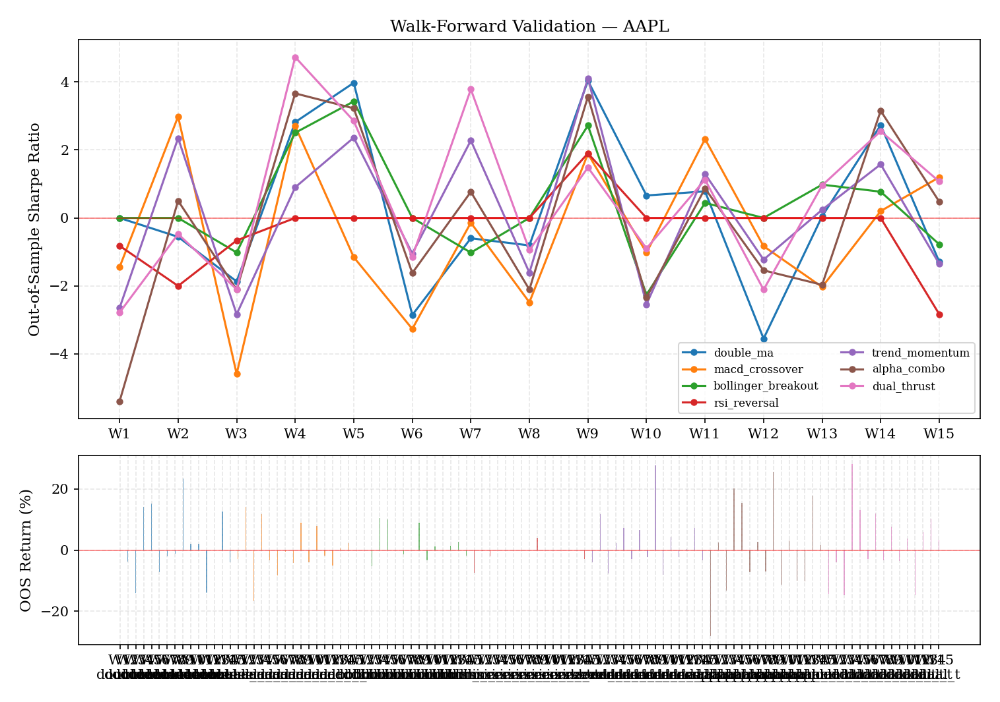

| Strategy | Windows | Avg OOS Sharpe | % Positive | Avg Return | Pass |
|----------|---------|---------------|------------|------------|------|
| double_ma | 15 | 0.235 | 47% | 1.58% | FAIL |
| macd_crossover | 15 | -0.378 | 40% | -0.11% | FAIL |
| bollinger_breakout | 15 | 0.385 | 40% | 1.56% | FAIL |
| rsi_reversal | 15 | -0.294 | 7% | -0.56% | FAIL |
| trend_momentum | 15 | 0.124 | 53% | 2.51% | PASS |
| alpha_combo | 15 | -0.057 | 53% | 0.15% | PASS |
| dual_thrust | 15 | 0.541 | 53% | 1.79% | PASS |

### TSLA

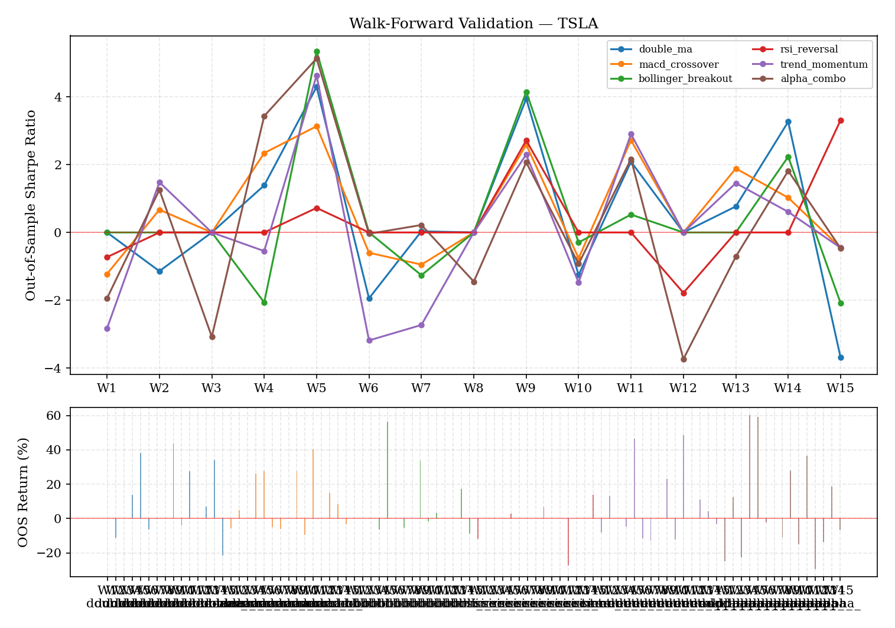

| Strategy | Windows | Avg OOS Sharpe | % Positive | Avg Return | Pass |
|----------|---------|---------------|------------|------------|------|
| double_ma | 15 | 0.517 | 47% | 8.07% | FAIL |
| macd_crossover | 15 | 0.693 | 47% | 8.00% | FAIL |
| bollinger_breakout | 15 | 0.437 | 27% | 5.93% | FAIL |
| rsi_reversal | 15 | 0.283 | 20% | -1.07% | FAIL |
| trend_momentum | 15 | 0.144 | 40% | 6.27% | FAIL |
| alpha_combo | 15 | 0.249 | 47% | 5.97% | FAIL |
| dual_thrust | 15 | 0.238 | 47% | 5.88% | FAIL |

### MSFT

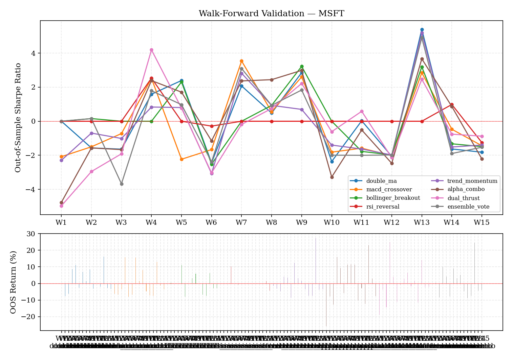

| Strategy | Windows | Avg OOS Sharpe | % Positive | Avg Return | Pass |
|----------|---------|---------------|------------|------------|------|
| double_ma | 15 | 0.086 | 47% | 1.70% | FAIL |
| macd_crossover | 15 | -0.232 | 33% | -0.08% | FAIL |
| bollinger_breakout | 15 | 0.048 | 33% | -0.11% | FAIL |
| rsi_reversal | 15 | 0.132 | 13% | 0.47% | FAIL |
| trend_momentum | 15 | -0.249 | 40% | 0.59% | FAIL |
| alpha_combo | 15 | -0.080 | 47% | 0.02% | FAIL |
| dual_thrust | 15 | -0.432 | 40% | -0.80% | FAIL |

### GOOG

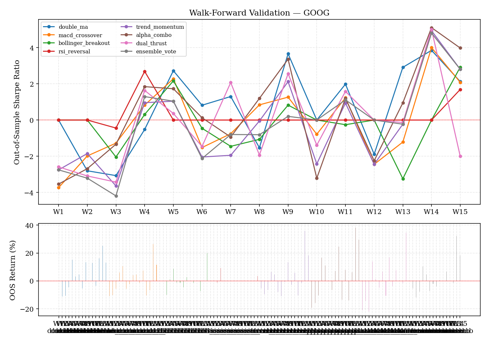

| Strategy | Windows | Avg OOS Sharpe | % Positive | Avg Return | Pass |
|----------|---------|---------------|------------|------------|------|
| double_ma | 15 | 0.637 | 53% | 4.57% | PASS |
| macd_crossover | 15 | -0.080 | 47% | 1.16% | FAIL |
| bollinger_breakout | 15 | -0.153 | 27% | 0.48% | FAIL |
| rsi_reversal | 15 | 0.262 | 13% | 0.77% | FAIL |
| trend_momentum | 15 | -0.305 | 40% | 1.93% | FAIL |
| alpha_combo | 15 | 0.369 | 60% | 4.13% | PASS |
| dual_thrust | 15 | -0.186 | 40% | 0.17% | FAIL |

### AMZN

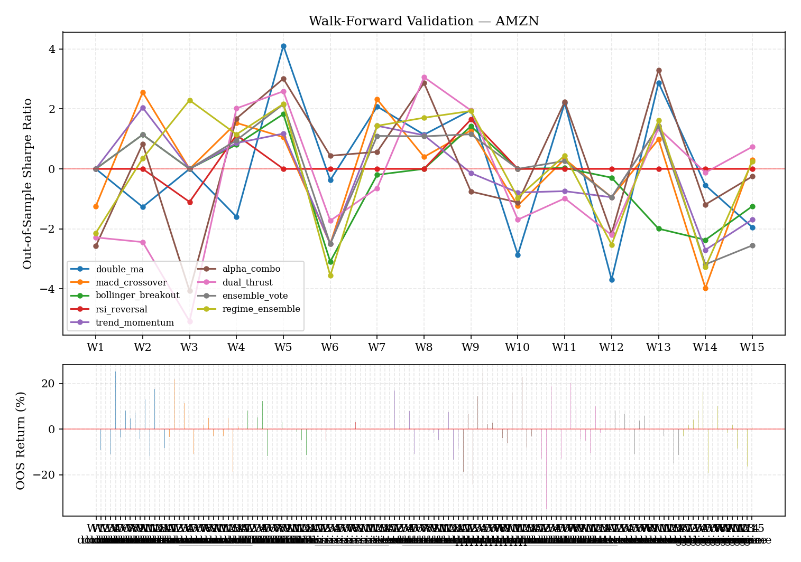

| Strategy | Windows | Avg OOS Sharpe | % Positive | Avg Return | Pass |
|----------|---------|---------------|------------|------------|------|
| double_ma | 15 | 0.138 | 40% | 1.62% | FAIL |
| macd_crossover | 15 | 0.058 | 60% | 1.50% | PASS |
| bollinger_breakout | 15 | -0.265 | 40% | -0.36% | FAIL |
| rsi_reversal | 15 | 0.112 | 13% | 0.14% | FAIL |
| trend_momentum | 15 | -0.097 | 40% | 0.43% | FAIL |
| alpha_combo | 15 | 0.188 | 53% | 2.02% | PASS |
| dual_thrust | 15 | -0.366 | 40% | -1.09% | FAIL |

### META

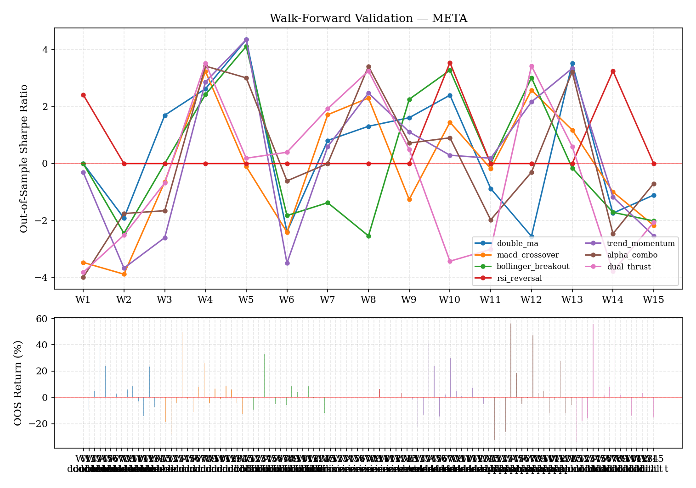

| Strategy | Windows | Avg OOS Sharpe | % Positive | Avg Return | Pass |
|----------|---------|---------------|------------|------------|------|
| double_ma | 15 | 0.514 | 53% | 4.75% | PASS |
| macd_crossover | 15 | -0.177 | 40% | 1.34% | FAIL |
| bollinger_breakout | 15 | 0.200 | 33% | 2.32% | FAIL |
| rsi_reversal | 15 | 0.614 | 20% | 1.29% | FAIL |
| trend_momentum | 15 | 0.239 | 60% | 4.21% | PASS |
| alpha_combo | 15 | 0.082 | 40% | 2.92% | FAIL |
| dual_thrust | 15 | -0.366 | 53% | 1.11% | PASS |

### AMD

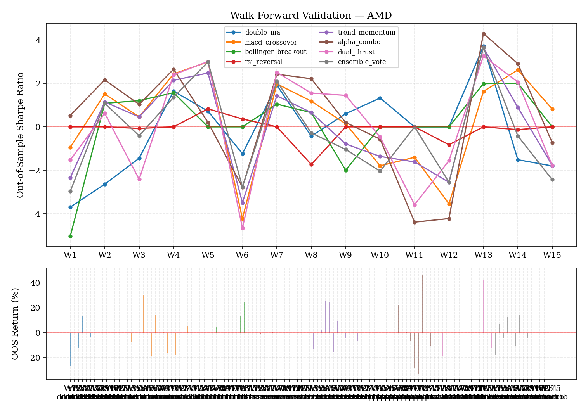

| Strategy | Windows | Avg OOS Sharpe | % Positive | Avg Return | Pass |
|----------|---------|---------------|------------|------------|------|
| double_ma | 15 | -0.188 | 40% | -1.37% | FAIL |
| macd_crossover | 15 | 0.258 | 67% | 5.67% | PASS |
| bollinger_breakout | 15 | 0.169 | 47% | 3.27% | FAIL |
| rsi_reversal | 15 | -0.104 | 13% | -0.74% | FAIL |
| trend_momentum | 15 | -0.070 | 53% | 3.50% | PASS |
| alpha_combo | 15 | 0.396 | 67% | 7.57% | PASS |
| dual_thrust | 15 | 0.058 | 53% | 2.44% | PASS |

### INTC

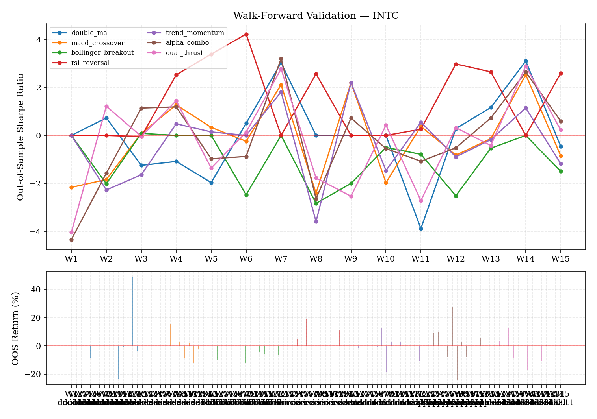

| Strategy | Windows | Avg OOS Sharpe | % Positive | Avg Return | Pass |
|----------|---------|---------------|------------|------------|------|
| double_ma | 15 | 0.012 | 40% | 2.24% | FAIL |
| macd_crossover | 15 | -0.100 | 47% | -0.12% | FAIL |
| bollinger_breakout | 15 | -1.004 | 7% | -3.45% | FAIL |
| rsi_reversal | 15 | 1.409 | 53% | 5.76% | PASS |
| trend_momentum | 15 | -0.325 | 47% | -2.04% | FAIL |
| alpha_combo | 15 | -0.154 | 47% | 0.30% | FAIL |
| dual_thrust | 15 | -0.229 | 53% | 0.63% | PASS |

### JPM

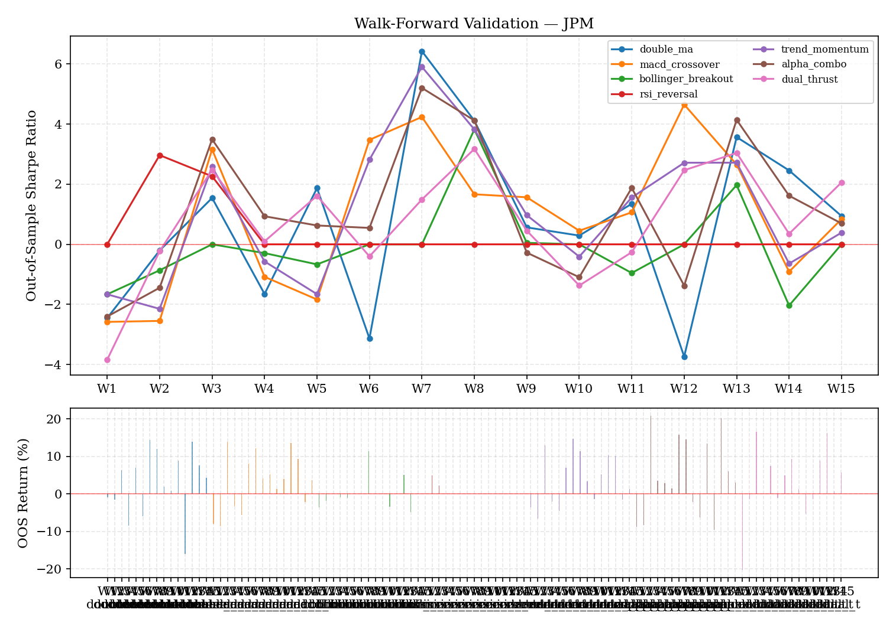

| Strategy | Windows | Avg OOS Sharpe | % Positive | Avg Return | Pass |
|----------|---------|---------------|------------|------------|------|
| double_ma | 15 | 0.796 | 67% | 2.93% | PASS |
| macd_crossover | 15 | 0.987 | 67% | 3.18% | PASS |
| bollinger_breakout | 15 | -0.042 | 20% | 0.06% | FAIL |
| rsi_reversal | 15 | 0.349 | 13% | 0.47% | FAIL |
| trend_momentum | 15 | 1.092 | 60% | 3.79% | PASS |
| alpha_combo | 15 | 1.111 | 67% | 4.43% | PASS |
| dual_thrust | 15 | 0.742 | 67% | 2.77% | PASS |

## Monte Carlo Simulation

Trade returns are extracted from bars with active positions (non-zero signal), shuffled, and used to reconstruct equity curves. This tests whether strategy performance depends on the specific sequence of trades.

### NVDA

| Strategy | Trades | Original Sharpe | MC 75th Pct | Percentile Rank | P(Ruin) | Pass |
|----------|--------|-----------------|-------------|-----------------|---------|------|
| double_ma | 782 | 1.200 | 1.200 | 100.0% | 0.0% | PASS |
| macd_crossover | 535 | 1.937 | 1.937 | 100.0% | 0.0% | FAIL |
| bollinger_breakout | 226 | 1.064 | 1.064 | 100.0% | 0.0% | FAIL |
| rsi_reversal | 38 | 1.759 | 1.759 | 80.7% | 0.0% | FAIL |
| trend_momentum | 545 | 1.778 | 1.778 | 83.1% | 0.0% | FAIL |
| alpha_combo | 920 | 1.121 | 1.121 | 99.8% | 0.0% | FAIL |
| dual_thrust | 628 | 2.071 | 2.071 | 89.4% | 0.0% | FAIL |

### AAPL

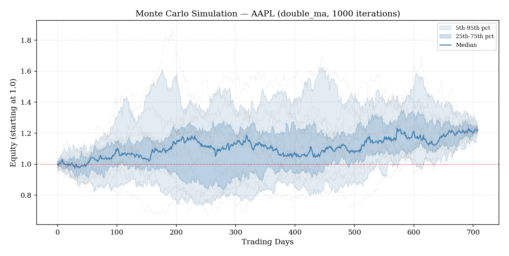

| Strategy | Trades | Original Sharpe | MC 75th Pct | Percentile Rank | P(Ruin) | Pass |
|----------|--------|-----------------|-------------|-----------------|---------|------|
| double_ma | 709 | 0.416 | 0.416 | 100.0% | 0.0% | FAIL |
| macd_crossover | 487 | 0.564 | 0.564 | 100.0% | 0.0% | FAIL |
| bollinger_breakout | 329 | 1.214 | 1.214 | 16.3% | 0.0% | FAIL |
| rsi_reversal | 78 | 0.481 | 0.481 | 38.3% | 0.0% | FAIL |
| trend_momentum | 532 | 0.954 | 0.954 | 100.0% | 0.0% | FAIL |
| alpha_combo | 863 | 0.532 | 0.532 | 99.9% | 0.0% | FAIL |
| dual_thrust | 697 | 0.834 | 0.834 | 85.1% | 0.0% | FAIL |

### TSLA

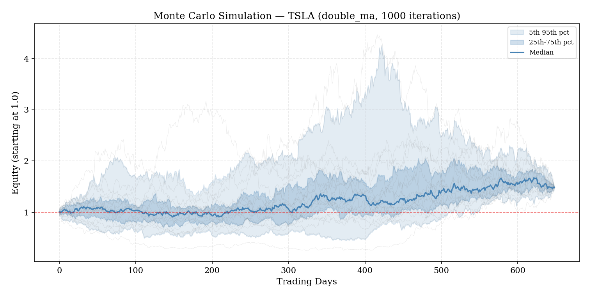

| Strategy | Trades | Original Sharpe | MC 75th Pct | Percentile Rank | P(Ruin) | Pass |
|----------|--------|-----------------|-------------|-----------------|---------|------|
| double_ma | 649 | 0.554 | 0.554 | 99.6% | 0.0% | FAIL |
| macd_crossover | 441 | 1.550 | 1.550 | 99.7% | 0.0% | FAIL |
| bollinger_breakout | 206 | 1.780 | 1.780 | 99.5% | 0.0% | PASS |
| rsi_reversal | 100 | -0.407 | -0.407 | 99.9% | 0.0% | FAIL |
| trend_momentum | 422 | 1.034 | 1.034 | 98.6% | 0.0% | FAIL |
| alpha_combo | 864 | 0.543 | 0.543 | 88.1% | 0.0% | FAIL |
| dual_thrust | 573 | 0.791 | 0.791 | 92.9% | 0.0% | FAIL |

### MSFT

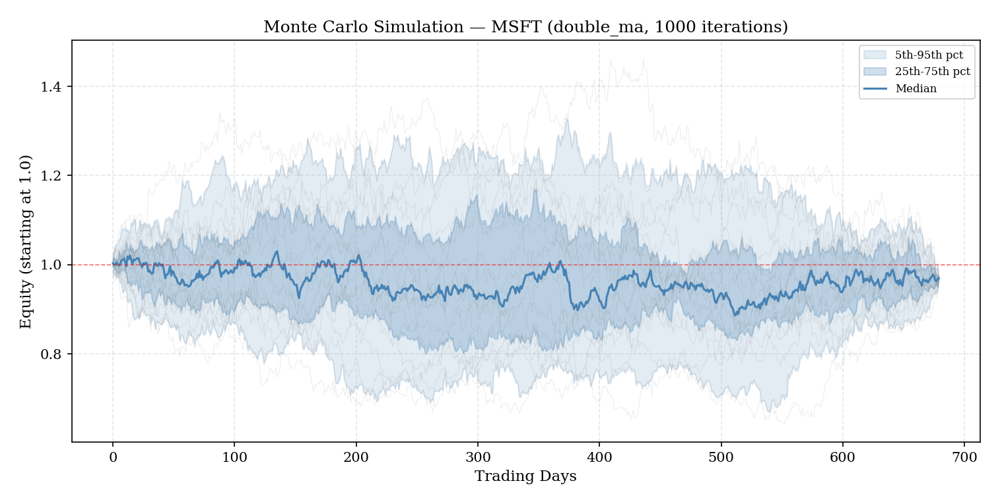

| Strategy | Trades | Original Sharpe | MC 75th Pct | Percentile Rank | P(Ruin) | Pass |
|----------|--------|-----------------|-------------|-----------------|---------|------|
| double_ma | 680 | 0.059 | 0.059 | 99.6% | 0.0% | FAIL |
| macd_crossover | 467 | 0.458 | 0.458 | 95.6% | 0.0% | FAIL |
| bollinger_breakout | 284 | 0.702 | 0.702 | 91.4% | 0.0% | FAIL |
| rsi_reversal | 106 | -0.065 | -0.065 | 97.2% | 0.0% | PASS |
| trend_momentum | 518 | 0.715 | 0.715 | 92.6% | 0.0% | FAIL |
| alpha_combo | 881 | -0.051 | -0.051 | 53.6% | 0.0% | FAIL |
| dual_thrust | 630 | 0.066 | 0.066 | 54.2% | 0.0% | FAIL |

### GOOG

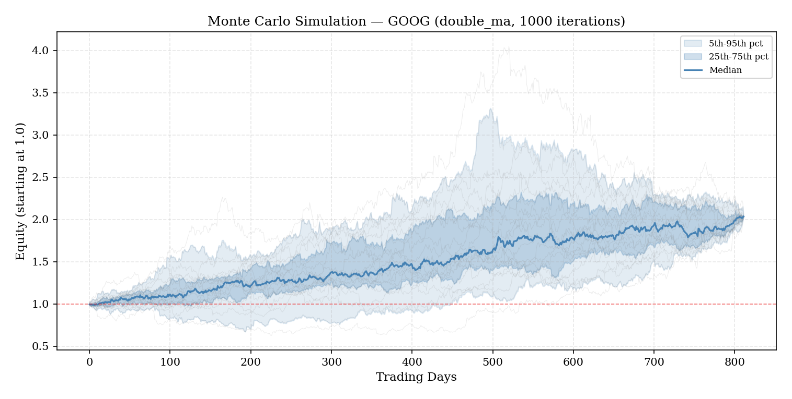

| Strategy | Trades | Original Sharpe | MC 75th Pct | Percentile Rank | P(Ruin) | Pass |
|----------|--------|-----------------|-------------|-----------------|---------|------|
| double_ma | 812 | 0.926 | 0.926 | 99.6% | 0.0% | FAIL |
| macd_crossover | 524 | 0.426 | 0.426 | 99.9% | 0.0% | FAIL |
| bollinger_breakout | 225 | 0.243 | 0.243 | 99.2% | 0.0% | FAIL |
| rsi_reversal | 50 | 2.873 | 2.873 | 81.6% | 0.0% | FAIL |
| trend_momentum | 507 | 0.345 | 0.345 | 100.0% | 0.0% | FAIL |
| alpha_combo | 931 | 0.514 | 0.514 | 91.6% | 0.0% | FAIL |
| dual_thrust | 667 | 0.371 | 0.371 | 100.0% | 0.0% | FAIL |

### AMZN

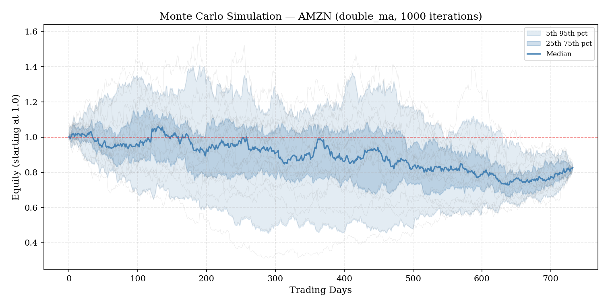

| Strategy | Trades | Original Sharpe | MC 75th Pct | Percentile Rank | P(Ruin) | Pass |
|----------|--------|-----------------|-------------|-----------------|---------|------|
| double_ma | 733 | -0.061 | -0.061 | 32.6% | 0.0% | FAIL |
| macd_crossover | 462 | 0.442 | 0.442 | 100.0% | 0.0% | FAIL |
| bollinger_breakout | 290 | -0.165 | -0.165 | 100.0% | 0.0% | FAIL |
| rsi_reversal | 69 | 1.727 | 1.727 | 87.7% | 0.0% | FAIL |
| trend_momentum | 483 | 0.185 | 0.185 | 100.0% | 0.0% | FAIL |
| alpha_combo | 873 | 0.249 | 0.249 | 85.6% | 0.0% | FAIL |
| dual_thrust | 643 | -0.380 | -0.380 | 99.7% | 0.0% | FAIL |

### META

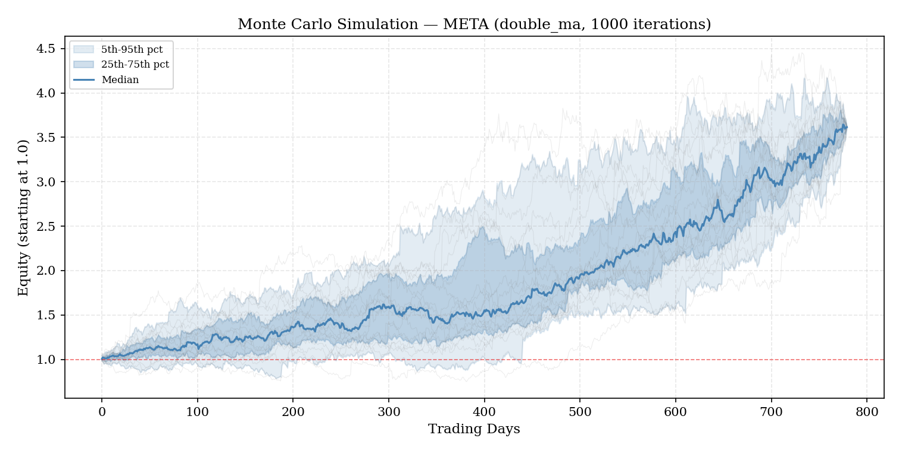

| Strategy | Trades | Original Sharpe | MC 75th Pct | Percentile Rank | P(Ruin) | Pass |
|----------|--------|-----------------|-------------|-----------------|---------|------|
| double_ma | 780 | 1.278 | 1.278 | 99.9% | 0.0% | PASS |
| macd_crossover | 476 | 0.067 | 0.067 | 100.0% | 0.0% | FAIL |
| bollinger_breakout | 298 | 1.234 | 1.234 | 100.0% | 0.0% | FAIL |
| rsi_reversal | 26 | 7.008 | 7.008 | 94.8% | 0.0% | FAIL |
| trend_momentum | 510 | 0.418 | 0.418 | 99.9% | 0.0% | FAIL |
| alpha_combo | 890 | 0.155 | 0.155 | 99.2% | 0.0% | FAIL |
| dual_thrust | 696 | -0.349 | -0.349 | 98.4% | 100.0% | FAIL |

### AMD

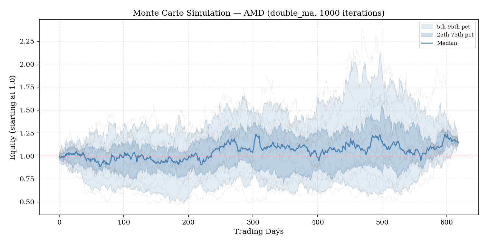

| Strategy | Trades | Original Sharpe | MC 75th Pct | Percentile Rank | P(Ruin) | Pass |
|----------|--------|-----------------|-------------|-----------------|---------|------|
| double_ma | 619 | 0.368 | 0.368 | 97.8% | 0.0% | FAIL |
| macd_crossover | 450 | 1.256 | 1.256 | 99.2% | 0.0% | FAIL |
| bollinger_breakout | 283 | 1.435 | 1.435 | 99.6% | 0.0% | PASS |
| rsi_reversal | 128 | -0.365 | -0.365 | 96.1% | 0.0% | FAIL |
| trend_momentum | 421 | 0.797 | 0.797 | 98.1% | 0.0% | FAIL |
| alpha_combo | 796 | 0.875 | 0.875 | 100.0% | 0.0% | PASS |
| dual_thrust | 686 | 0.433 | 0.433 | 95.5% | 0.0% | FAIL |

### INTC

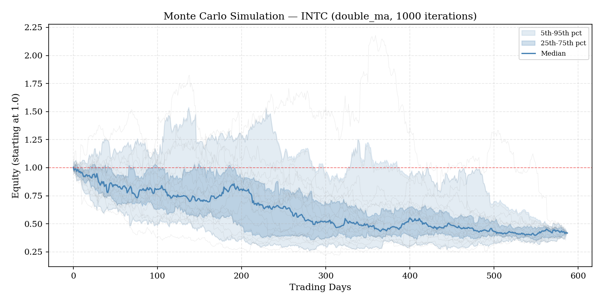

| Strategy | Trades | Original Sharpe | MC 75th Pct | Percentile Rank | P(Ruin) | Pass |
|----------|--------|-----------------|-------------|-----------------|---------|------|
| double_ma | 588 | -0.399 | -0.399 | 97.9% | 100.0% | FAIL |
| macd_crossover | 394 | -0.178 | -0.178 | 99.6% | 0.0% | FAIL |
| bollinger_breakout | 146 | -2.696 | -2.696 | 100.0% | 0.0% | FAIL |
| rsi_reversal | 108 | 4.569 | 4.569 | 43.4% | 0.0% | FAIL |
| trend_momentum | 322 | -0.805 | -0.805 | 99.4% | 100.0% | FAIL |
| alpha_combo | 793 | -0.103 | -0.103 | 98.3% | 0.0% | FAIL |
| dual_thrust | 597 | 0.210 | 0.210 | 99.1% | 0.0% | FAIL |

### JPM

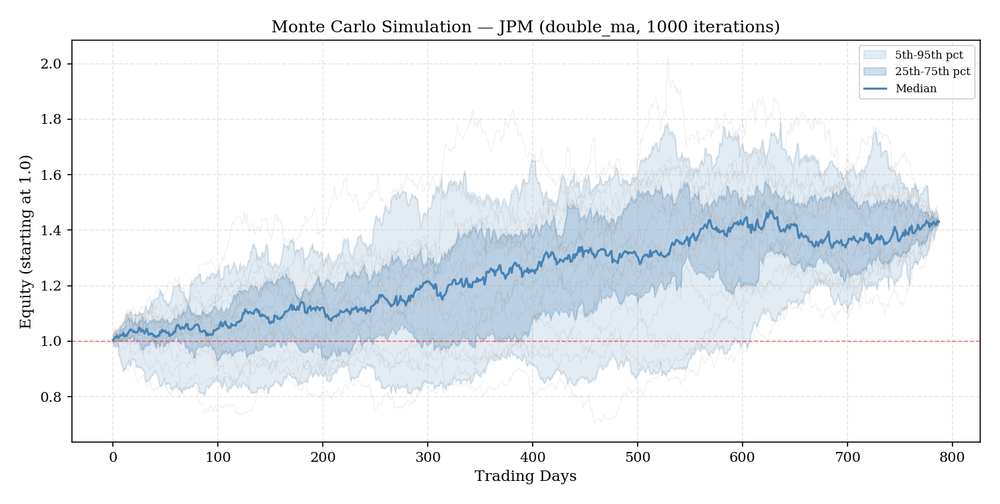

| Strategy | Trades | Original Sharpe | MC 75th Pct | Percentile Rank | P(Ruin) | Pass |
|----------|--------|-----------------|-------------|-----------------|---------|------|
| double_ma | 788 | 0.640 | 0.640 | 93.2% | 0.0% | FAIL |
| macd_crossover | 514 | 0.504 | 0.504 | 100.0% | 0.0% | FAIL |
| bollinger_breakout | 264 | 0.113 | 0.113 | 99.9% | 0.0% | FAIL |
| rsi_reversal | 45 | 4.727 | 4.727 | 100.0% | 0.0% | FAIL |
| trend_momentum | 547 | 0.857 | 0.857 | 90.2% | 0.0% | FAIL |
| alpha_combo | 910 | 0.580 | 0.580 | 97.4% | 0.0% | FAIL |
| dual_thrust | 673 | 0.559 | 0.559 | 100.0% | 0.0% | FAIL |

## Statistical Significance

One-sided t-test on trade returns (H0: mean return = 0). Bootstrap 95% CI on Sharpe ratio (5,000 resamples). Deflated Sharpe Ratio corrects for multiple testing (Bailey & Lopez de Prado 2014). Minimum 7 strategies tested per run.

Tests require a minimum of 20 trades. Strategies with fewer trades are marked 'Insufficient data.'

### NVDA

| Strategy | n | t-stat | p-value | Sharpe [95% CI] | DSR | Sig? |
|----------|---|--------|---------|-----------------|-----|------|
| double_ma | 782 | 2.11 | 0.0175 | 1.20 [0.09, 2.26] | 1.000 | Yes |
| macd_crossover | 535 | 2.82 | 0.0025 | 1.94 [0.64, 3.25] | 1.000 | Yes |
| bollinger_breakout | 226 | 1.01 | 0.1579 | 1.06 [-1.14, 2.87] | 0.023 | No |
| rsi_reversal | 38 | 0.67 | 0.2523 | 1.76 [-3.33, 7.29] | 0.000 | No |
| trend_momentum | 545 | 2.61 | 0.0046 | 1.78 [0.45, 3.02] | 1.000 | Yes |
| alpha_combo | 920 | 2.14 | 0.0163 | 1.12 [0.13, 2.16] | 1.000 | Yes |
| dual_thrust | 628 | 3.27 | 0.0006 | 2.07 [0.88, 3.21] | 1.000 | Yes |

### AAPL

| Strategy | n | t-stat | p-value | Sharpe [95% CI] | DSR | Sig? |
|----------|---|--------|---------|-----------------|-----|------|
| double_ma | 709 | 0.70 | 0.2431 | 0.42 [-0.83, 1.54] | 0.000 | No |
| macd_crossover | 487 | 0.78 | 0.2168 | 0.56 [-0.89, 1.97] | 0.000 | No |
| bollinger_breakout | 329 | 1.39 | 0.0834 | 1.21 [-0.54, 2.89] | 0.537 | No |
| rsi_reversal | 78 | 0.27 | 0.3956 | 0.48 [-3.10, 4.38] | 0.000 | No |
| trend_momentum | 532 | 1.38 | 0.0834 | 0.95 [-0.40, 2.33] | 0.433 | No |
| alpha_combo | 863 | 0.98 | 0.1625 | 0.53 [-0.51, 1.60] | 0.000 | No |
| dual_thrust | 697 | 1.39 | 0.0830 | 0.83 [-0.35, 1.97] | 0.578 | No |

### TSLA

| Strategy | n | t-stat | p-value | Sharpe [95% CI] | DSR | Sig? |
|----------|---|--------|---------|-----------------|-----|------|
| double_ma | 649 | 0.89 | 0.1873 | 0.55 [-0.72, 1.78] | 0.000 | No |
| macd_crossover | 441 | 2.05 | 0.0205 | 1.55 [0.12, 3.03] | 1.000 | Yes |
| bollinger_breakout | 206 | 1.61 | 0.0549 | 1.78 [-0.40, 4.05] | 0.920 | No |
| rsi_reversal | 100 | -0.25 | 0.6003 | -0.41 [-3.52, 2.87] | 0.000 | No |
| trend_momentum | 422 | 1.34 | 0.0910 | 1.03 [-0.50, 2.51] | 0.270 | No |
| alpha_combo | 864 | 1.01 | 0.1575 | 0.54 [-0.54, 1.60] | 0.000 | No |
| dual_thrust | 573 | 1.19 | 0.1169 | 0.79 [-0.50, 2.06] | 0.016 | No |

### MSFT

| Strategy | n | t-stat | p-value | Sharpe [95% CI] | DSR | Sig? |
|----------|---|--------|---------|-----------------|-----|------|
| double_ma | 680 | 0.10 | 0.4614 | 0.06 [-1.15, 1.24] | 0.000 | No |
| macd_crossover | 467 | 0.62 | 0.2668 | 0.46 [-0.93, 1.96] | 0.000 | No |
| bollinger_breakout | 284 | 0.74 | 0.2288 | 0.70 [-1.08, 2.72] | 0.000 | No |
| rsi_reversal | 106 | -0.04 | 0.5168 | -0.07 [-2.79, 3.27] | 0.000 | No |
| trend_momentum | 518 | 1.02 | 0.1531 | 0.71 [-0.66, 2.14] | 0.000 | No |
| alpha_combo | 881 | -0.09 | 0.5377 | -0.05 [-1.11, 0.99] | 0.000 | No |
| dual_thrust | 630 | 0.10 | 0.4585 | 0.07 [-1.14, 1.30] | 0.000 | No |

### GOOG

| Strategy | n | t-stat | p-value | Sharpe [95% CI] | DSR | Sig? |
|----------|---|--------|---------|-----------------|-----|------|
| double_ma | 812 | 1.66 | 0.0485 | 0.93 [-0.17, 2.02] | 0.994 | Yes |
| macd_crossover | 524 | 0.61 | 0.2701 | 0.43 [-0.99, 1.78] | 0.000 | No |
| bollinger_breakout | 225 | 0.23 | 0.4093 | 0.24 [-1.86, 2.42] | 0.000 | No |
| rsi_reversal | 50 | 1.27 | 0.1056 | 2.87 [-1.51, 7.26] | 0.116 | No |
| trend_momentum | 507 | 0.49 | 0.3125 | 0.35 [-1.02, 1.72] | 0.000 | No |
| alpha_combo | 931 | 0.99 | 0.1618 | 0.51 [-0.53, 1.52] | 0.000 | No |
| dual_thrust | 667 | 0.60 | 0.2732 | 0.37 [-0.80, 1.61] | 0.000 | No |

### AMZN

| Strategy | n | t-stat | p-value | Sharpe [95% CI] | DSR | Sig? |
|----------|---|--------|---------|-----------------|-----|------|
| double_ma | 733 | -0.10 | 0.5411 | -0.06 [-1.20, 1.08] | 0.000 | No |
| macd_crossover | 462 | 0.60 | 0.2750 | 0.44 [-1.03, 1.85] | 0.000 | No |
| bollinger_breakout | 290 | -0.18 | 0.5699 | -0.16 [-1.93, 1.69] | 0.000 | No |
| rsi_reversal | 69 | 0.90 | 0.1864 | 1.73 [-2.17, 5.72] | 0.000 | No |
| trend_momentum | 483 | 0.26 | 0.3990 | 0.19 [-1.22, 1.60] | 0.000 | No |
| alpha_combo | 873 | 0.46 | 0.3218 | 0.25 [-0.81, 1.32] | 0.000 | No |
| dual_thrust | 643 | -0.61 | 0.7280 | -0.38 [-1.66, 0.82] | 0.000 | No |

### META

| Strategy | n | t-stat | p-value | Sharpe [95% CI] | DSR | Sig? |
|----------|---|--------|---------|-----------------|-----|------|
| double_ma | 780 | 2.25 | 0.0124 | 1.28 [0.20, 2.24] | 1.000 | Yes |
| macd_crossover | 476 | 0.09 | 0.4634 | 0.07 [-1.49, 1.36] | 0.000 | No |
| bollinger_breakout | 298 | 1.34 | 0.0906 | 1.23 [-0.49, 2.72] | 0.619 | No |
| rsi_reversal | 26 | 2.21 | 0.0183 | 7.01 [0.99, 14.31] | 0.978 | Yes |
| trend_momentum | 510 | 0.59 | 0.2764 | 0.42 [-1.04, 1.67] | 0.000 | No |
| alpha_combo | 890 | 0.29 | 0.3858 | 0.15 [-0.90, 1.24] | 0.000 | No |
| dual_thrust | 696 | -0.58 | 0.7189 | -0.35 [-1.52, 0.83] | 0.000 | No |

### AMD

| Strategy | n | t-stat | p-value | Sharpe [95% CI] | DSR | Sig? |
|----------|---|--------|---------|-----------------|-----|------|
| double_ma | 619 | 0.58 | 0.2822 | 0.37 [-0.85, 1.65] | 0.000 | No |
| macd_crossover | 450 | 1.68 | 0.0471 | 1.26 [-0.16, 2.69] | 0.995 | Yes |
| bollinger_breakout | 283 | 1.52 | 0.0650 | 1.44 [-0.42, 3.20] | 0.951 | No |
| rsi_reversal | 128 | -0.26 | 0.6020 | -0.36 [-3.06, 2.56] | 0.000 | No |
| trend_momentum | 421 | 1.03 | 0.1521 | 0.80 [-0.74, 2.35] | 0.000 | No |
| alpha_combo | 796 | 1.55 | 0.0604 | 0.87 [-0.25, 1.93] | 0.980 | No |
| dual_thrust | 686 | 0.71 | 0.2378 | 0.43 [-0.79, 1.61] | 0.000 | No |

### INTC

| Strategy | n | t-stat | p-value | Sharpe [95% CI] | DSR | Sig? |
|----------|---|--------|---------|-----------------|-----|------|
| double_ma | 588 | -0.61 | 0.7285 | -0.40 [-1.70, 0.90] | 0.000 | No |
| macd_crossover | 394 | -0.22 | 0.5879 | -0.18 [-1.76, 1.38] | 0.000 | No |
| bollinger_breakout | 146 | -2.05 | 0.9787 | -2.70 [-5.38, -0.11] | 0.000 | No |
| rsi_reversal | 108 | 2.98 | 0.0018 | 4.57 [1.79, 7.44] | 1.000 | Yes |
| trend_momentum | 322 | -0.91 | 0.8180 | -0.81 [-2.57, 0.97] | 0.000 | No |
| alpha_combo | 793 | -0.18 | 0.5724 | -0.10 [-1.26, 1.03] | 0.000 | No |
| dual_thrust | 597 | 0.32 | 0.3736 | 0.21 [-1.06, 1.49] | 0.000 | No |

### JPM

| Strategy | n | t-stat | p-value | Sharpe [95% CI] | DSR | Sig? |
|----------|---|--------|---------|-----------------|-----|------|
| double_ma | 788 | 1.13 | 0.1291 | 0.64 [-0.48, 1.77] | 0.001 | No |
| macd_crossover | 514 | 0.72 | 0.2360 | 0.50 [-0.82, 1.93] | 0.000 | No |
| bollinger_breakout | 264 | 0.12 | 0.4541 | 0.11 [-1.72, 2.07] | 0.000 | No |
| rsi_reversal | 45 | 1.98 | 0.0273 | 4.73 [0.17, 10.08] | 0.967 | Yes |
| trend_momentum | 547 | 1.26 | 0.1037 | 0.86 [-0.50, 2.27] | 0.050 | No |
| alpha_combo | 910 | 1.10 | 0.1354 | 0.58 [-0.46, 1.63] | 0.000 | No |
| dual_thrust | 673 | 0.91 | 0.1810 | 0.56 [-0.67, 1.82] | 0.000 | No |

## Strategy Comparison

## Methodology Notes

- **Walk-forward:** Expanding window, 252-day initial training, 63-day quarterly test windows, minimum 4 windows
- **Indicators:** Computed per-window with 50-bar warmup buffer (prevents lookahead bias from rolling indicators)
- **Monte Carlo:** 1000 iterations, shuffling non-zero trade returns only
- **Statistical tests:** One-sided t-test (p < 0.05), bootstrap 95% CI (5,000 resamples)
- **DSR:** Deflated Sharpe Ratio with 7 strategies tested. DSR > 0.5 = pass. Results are not comparable across separate invocations
- **Minimum trades:** 20 required for statistical tests
- **Pass/fail gates:** Walk-forward OOS Sharpe > 0 in >50% of windows; Monte Carlo strategy Sharpe > 75th percentile; t-test p < 0.05
