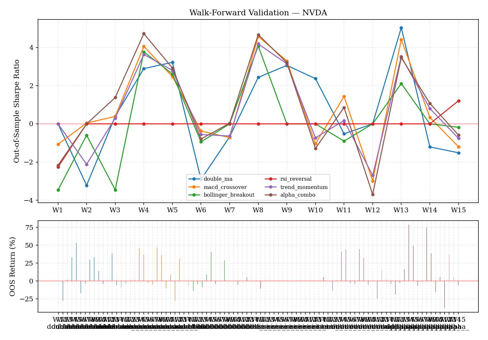
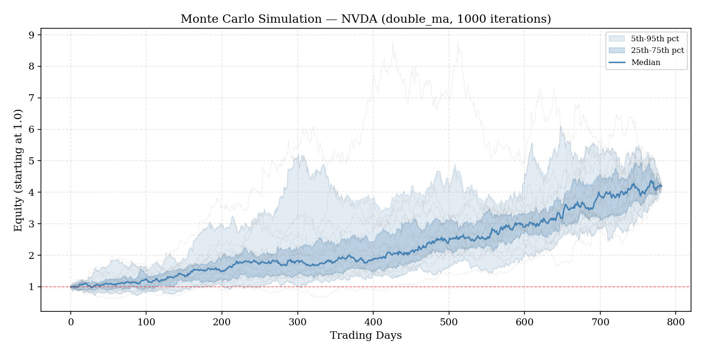
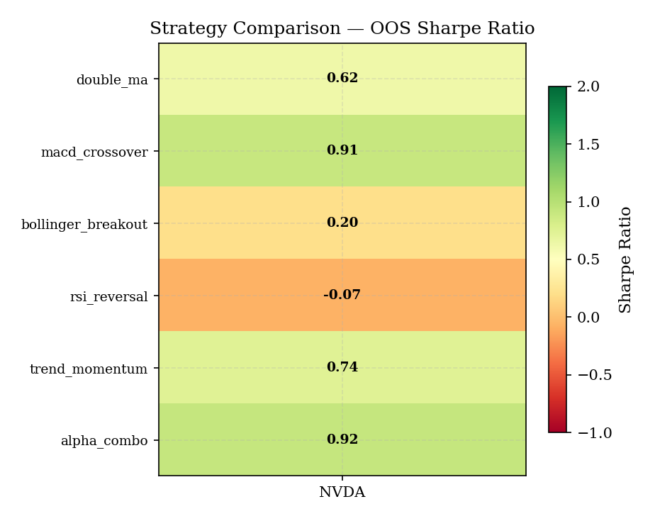

# Orallexa Evaluation Report

Generated: 2026-04-02 15:10 | Tickers: NVDA | Strategies: 6 | Skipped: None

## Executive Summary

**0/6** strategy-ticker pairs passed all evaluation gates.

| Strategy | Ticker | OOS Sharpe | Info Ratio | MC Pct | p-value | Verdict |
|----------|--------|-----------|------------|--------|---------|---------|
| alpha_combo | NVDA | 0.920 | -1.073 | 85.4% | 0.0163 | FAIL |
| macd_crossover | NVDA | 0.909 | -1.007 | 75.2% | 0.0025 | FAIL |
| trend_momentum | NVDA | 0.738 | -1.125 | 73.3% | 0.0046 | FAIL |
| double_ma | NVDA | 0.625 | -1.532 | 100.0% | 0.0175 | FAIL |
| bollinger_breakout | NVDA | 0.201 | -1.326 | 97.7% | 0.1579 | FAIL |
| rsi_reversal | NVDA | -0.070 | -1.365 | 96.8% | 0.2523 | FAIL |

## Walk-Forward Validation

Expanding-window walk-forward: each strategy is evaluated on sequential out-of-sample windows. Indicators are computed per-window with a 50-bar warmup buffer to prevent data leakage.

### NVDA

| Strategy | Windows | Avg OOS Sharpe | % Positive | Avg Return | Pass |
|----------|---------|---------------|------------|------------|------|
| double_ma | 15 | 0.625 | 47% | 9.21% | FAIL |
| macd_crossover | 15 | 0.909 | 60% | 10.14% | PASS |
| bollinger_breakout | 15 | 0.201 | 27% | 3.16% | FAIL |
| rsi_reversal | 15 | -0.070 | 7% | -0.35% | FAIL |
| trend_momentum | 15 | 0.738 | 53% | 8.44% | PASS |
| alpha_combo | 15 | 0.920 | 60% | 14.66% | PASS |

## Monte Carlo Simulation

Trade returns are extracted from bars with active positions (non-zero signal), shuffled, and used to reconstruct equity curves. This tests whether strategy performance depends on the specific sequence of trades.

### NVDA

| Strategy | Trades | Original Sharpe | MC 75th Pct | Percentile Rank | P(Ruin) | Pass |
|----------|--------|-----------------|-------------|-----------------|---------|------|
| double_ma | 782 | 1.200 | 1.200 | 100.0% | 0.0% | FAIL |
| macd_crossover | 535 | 1.937 | 1.937 | 75.2% | 0.0% | FAIL |
| bollinger_breakout | 226 | 1.064 | 1.064 | 97.7% | 0.0% | FAIL |
| rsi_reversal | 38 | 1.759 | 1.759 | 96.8% | 0.0% | FAIL |
| trend_momentum | 545 | 1.778 | 1.778 | 73.3% | 0.0% | FAIL |
| alpha_combo | 920 | 1.121 | 1.121 | 85.4% | 0.0% | FAIL |

## Statistical Significance

One-sided t-test on trade returns (H0: mean return = 0). Bootstrap 95% CI on Sharpe ratio (5,000 resamples). Deflated Sharpe Ratio corrects for multiple testing (Bailey & Lopez de Prado 2014). Minimum 6 strategies tested per run.

Tests require a minimum of 20 trades. Strategies with fewer trades are marked 'Insufficient data.'

### NVDA

| Strategy | n | t-stat | p-value | Sharpe [95% CI] | DSR | Sig? |
|----------|---|--------|---------|-----------------|-----|------|
| double_ma | 782 | 2.11 | 0.0175 | 1.20 [0.09, 2.26] | 1.000 | Yes |
| macd_crossover | 535 | 2.82 | 0.0025 | 1.94 [0.64, 3.25] | 1.000 | Yes |
| bollinger_breakout | 226 | 1.01 | 0.1579 | 1.06 [-1.14, 2.87] | 0.076 | No |
| rsi_reversal | 38 | 0.67 | 0.2523 | 1.76 [-3.33, 7.29] | 0.000 | No |
| trend_momentum | 545 | 2.61 | 0.0046 | 1.78 [0.45, 3.02] | 1.000 | Yes |
| alpha_combo | 920 | 2.14 | 0.0163 | 1.12 [0.13, 2.16] | 1.000 | Yes |

## Strategy Comparison

## Methodology Notes

- **Walk-forward:** Expanding window, 252-day initial training, 63-day quarterly test windows, minimum 4 windows
- **Indicators:** Computed per-window with 50-bar warmup buffer (prevents lookahead bias from rolling indicators)
- **Monte Carlo:** 1000 iterations, shuffling non-zero trade returns only
- **Statistical tests:** One-sided t-test (p < 0.05), bootstrap 95% CI (5,000 resamples)
- **DSR:** Deflated Sharpe Ratio with 6 strategies tested. DSR > 0.5 = pass. Results are not comparable across separate invocations
- **Minimum trades:** 20 required for statistical tests
- **Pass/fail gates:** Walk-forward OOS Sharpe > 0 in >50% of windows; Monte Carlo strategy Sharpe > 75th percentile; t-test p < 0.05
